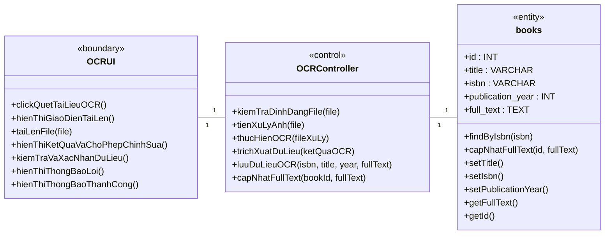

#### 2.3.10.2. Biểu đồ lớp phân tích – OCR – Dữ liệu số

```mermaid
classDiagram
    direction LR
    class OCRUI {
        <<boundary>>
        +clickQuetTaiLieuOCR()
        +hienThiGiaoDienTaiLen()
        +taiLenFile(file)
        +hienThiKetQuaVaChoPhepChinhSua()
        +kiemTraVaXacNhanDuLieu()
        +hienThiThongBaoLoi()
        +hienThiThongBaoThanhCong()
    }
    class OCRController {
        <<control>>
        +kiemTraDinhDangFile(file)
        +tienXuLyAnh(file)
        +thucHienOCR(fileXuLy)
        +trichXuatDuLieu(ketQuaOCR)
        +luuDuLieuOCR(isbn, title, year, fullText)
        +capNhatFullText(bookId, fullText)
    }
    class books {
        <<entity>>
        +id : INT
        +title : VARCHAR
        +isbn : VARCHAR
        +publication_year : INT
        +full_text : TEXT
        +findByIsbn(isbn)
        +capNhatFullText(id, fullText)
        +setTitle()
        +setIsbn()
        +setPublicationYear()
        +getFullText()
        +getId()
    }
    OCRUI "1" -- "1" OCRController
    OCRController "1" -- "1" books
```

*Hình 2.23. Biểu đồ lớp phân tích – OCR – Dữ liệu số*
