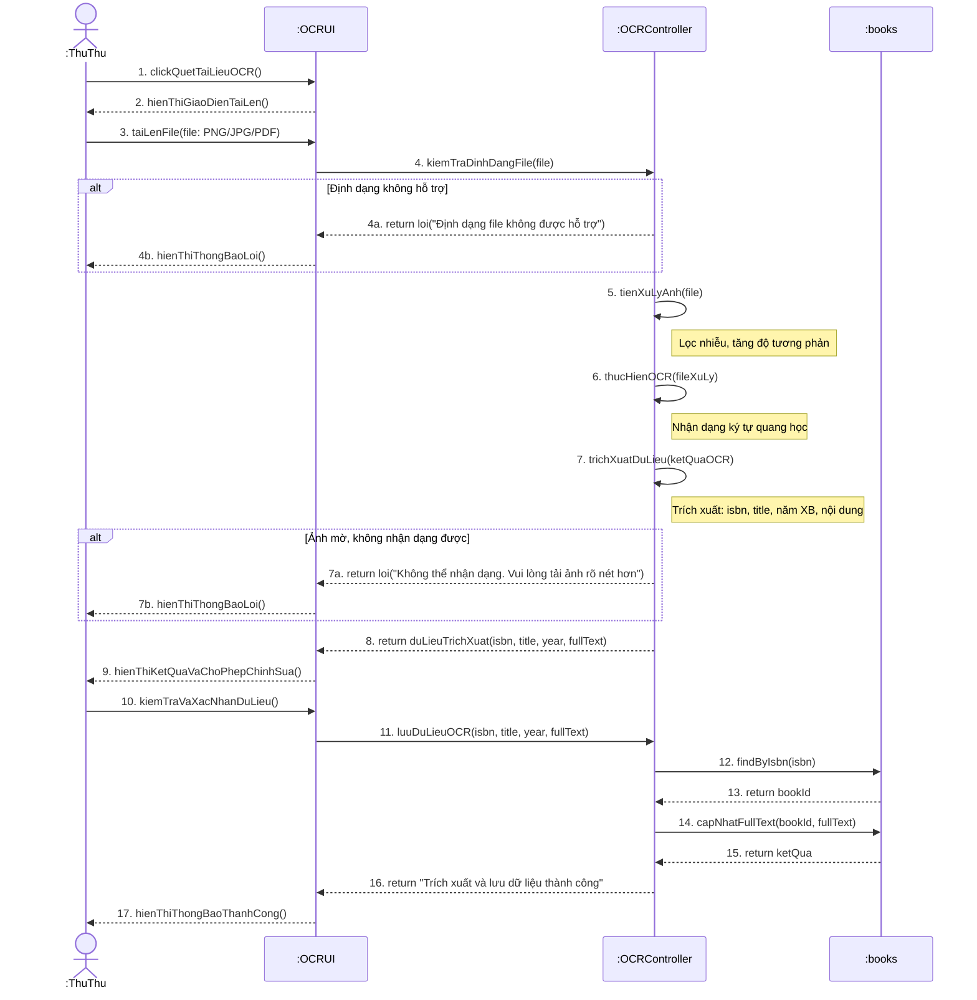

#### 2.3.10.1. Biểu đồ trình tự – OCR – Dữ liệu số

```mermaid
sequenceDiagram
    actor ThuThu as :ThuThu
    participant UI as :OCRUI
    participant CTRL as :OCRController
    participant DB as :books

    ThuThu->>UI: 1. clickQuetTaiLieuOCR()
    UI-->>ThuThu: 2. hienThiGiaoDienTaiLen()
    ThuThu->>UI: 3. taiLenFile(file: PNG/JPG/PDF)
    UI->>CTRL: 4. kiemTraDinhDangFile(file)
    alt Định dạng không hỗ trợ
        CTRL-->>UI: 4a. return loi("Định dạng file không được hỗ trợ")
        UI-->>ThuThu: 4b. hienThiThongBaoLoi()
    end
    CTRL->>CTRL: 5. tienXuLyAnh(file)
    Note right of CTRL: Lọc nhiễu, tăng độ tương phản
    CTRL->>CTRL: 6. thucHienOCR(fileXuLy)
    Note right of CTRL: Nhận dạng ký tự quang học
    CTRL->>CTRL: 7. trichXuatDuLieu(ketQuaOCR)
    Note right of CTRL: Trích xuất: isbn, title, năm XB, nội dung
    alt Ảnh mờ, không nhận dạng được
        CTRL-->>UI: 7a. return loi("Không thể nhận dạng. Vui lòng tải ảnh rõ nét hơn")
        UI-->>ThuThu: 7b. hienThiThongBaoLoi()
    end
    CTRL-->>UI: 8. return duLieuTrichXuat(isbn, title, year, fullText)
    UI-->>ThuThu: 9. hienThiKetQuaVaChoPhepChinhSua()
    ThuThu->>UI: 10. kiemTraVaXacNhanDuLieu()
    UI->>CTRL: 11. luuDuLieuOCR(isbn, title, year, fullText)
    CTRL->>DB: 12. findByIsbn(isbn)
    DB-->>CTRL: 13. return bookId
    CTRL->>DB: 14. capNhatFullText(bookId, fullText)
    DB-->>CTRL: 15. return ketQua
    CTRL-->>UI: 16. return "Trích xuất và lưu dữ liệu thành công"
    UI-->>ThuThu: 17. hienThiThongBaoThanhCong()
```

*Hình 2.22. Biểu đồ trình tự – OCR – Dữ liệu số*
