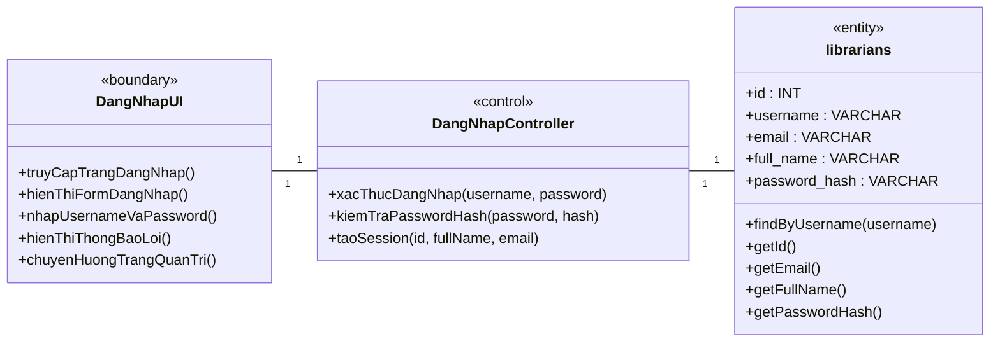

#### 2.3.1.2. Biểu đồ lớp phân tích – Đăng nhập

```mermaid
classDiagram
    direction LR
    class DangNhapUI {
        <<boundary>>
        +truyCapTrangDangNhap()
        +hienThiFormDangNhap()
        +nhapUsernameVaPassword()
        +hienThiThongBaoLoi()
        +chuyenHuongTrangQuanTri()
    }
    class DangNhapController {
        <<control>>
        +xacThucDangNhap(username, password)
        +kiemTraPasswordHash(password, hash)
        +taoSession(id, fullName, email)
    }
    class librarians {
        <<entity>>
        +id : INT
        +username : VARCHAR
        +email : VARCHAR
        +full_name : VARCHAR
        +password_hash : VARCHAR
        +findByUsername(username)
        +getId()
        +getEmail()
        +getFullName()
        +getPasswordHash()
    }
    DangNhapUI "1" -- "1" DangNhapController
    DangNhapController "1" -- "1" librarians
```

*Hình 2.5. Biểu đồ lớp phân tích – Đăng nhập*
