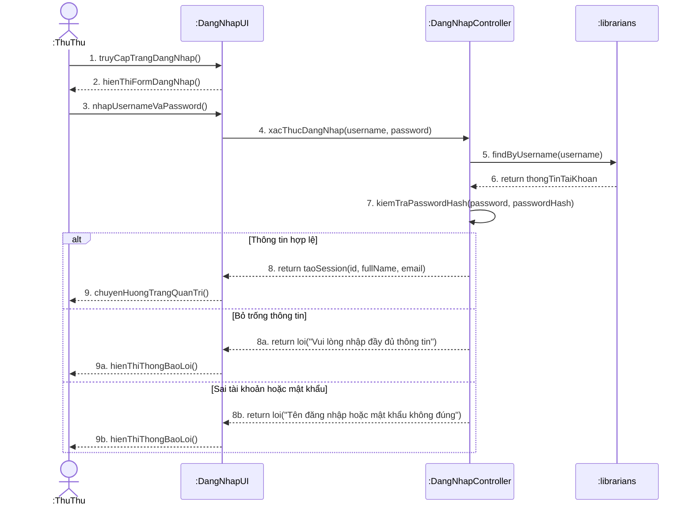

#### 2.3.1.1. Biểu đồ trình tự – Đăng nhập

```mermaid
sequenceDiagram
    actor ThuThu as :ThuThu
    participant UI as :DangNhapUI
    participant CTRL as :DangNhapController
    participant DB as :librarians

    ThuThu->>UI: 1. truyCapTrangDangNhap()
    UI-->>ThuThu: 2. hienThiFormDangNhap()
    ThuThu->>UI: 3. nhapUsernameVaPassword()
    UI->>CTRL: 4. xacThucDangNhap(username, password)
    CTRL->>DB: 5. findByUsername(username)
    DB-->>CTRL: 6. return thongTinTaiKhoan
    CTRL->>CTRL: 7. kiemTraPasswordHash(password, passwordHash)
    alt Thông tin hợp lệ
        CTRL-->>UI: 8. return taoSession(id, fullName, email)
        UI-->>ThuThu: 9. chuyenHuongTrangQuanTri()
    else Bỏ trống thông tin
        CTRL-->>UI: 8a. return loi("Vui lòng nhập đầy đủ thông tin")
        UI-->>ThuThu: 9a. hienThiThongBaoLoi()
    else Sai tài khoản hoặc mật khẩu
        CTRL-->>UI: 8b. return loi("Tên đăng nhập hoặc mật khẩu không đúng")
        UI-->>ThuThu: 9b. hienThiThongBaoLoi()
    end
```

*Hình 2.4. Biểu đồ trình tự – Đăng nhập*
