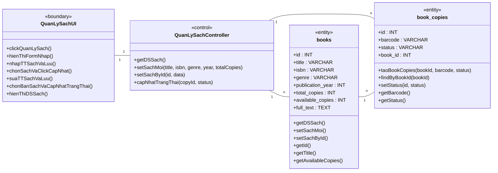

#### 2.3.2.2. Biểu đồ lớp phân tích – Quản lý sách

```mermaid
classDiagram
    direction LR
    class QuanLySachUI {
        <<boundary>>
        +clickQuanLySach()
        +hienThiFormNhap()
        +nhapTTSachVaLuu()
        +chonSachVaClickCapNhat()
        +suaTTSachVaLuu()
        +chonBanSachVaCapNhatTrangThai()
        +hienThiDSSach()
    }
    class QuanLySachController {
        <<control>>
        +getDSSach()
        +setSachMoi(title, isbn, genre, year, totalCopies)
        +setSachById(id, data)
        +capNhatTrangThai(copyId, status)
    }
    class books {
        <<entity>>
        +id : INT
        +title : VARCHAR
        +isbn : VARCHAR
        +genre : VARCHAR
        +publication_year : INT
        +total_copies : INT
        +available_copies : INT
        +full_text : TEXT
        +getDSSach()
        +setSachMoi()
        +setSachById()
        +getId()
        +getTitle()
        +getAvailableCopies()
    }
    class book_copies {
        <<entity>>
        +id : INT
        +barcode : VARCHAR
        +status : VARCHAR
        +book_id : INT
        +taoBookCopies(bookId, barcode, status)
        +findByBookId(bookId)
        +setStatus(id, status)
        +getBarcode()
        +getStatus()
    }
    QuanLySachUI "1" -- "1" QuanLySachController
    QuanLySachController "1" -- "n" books
    QuanLySachController "1" -- "n" book_copies
    books "1" -- "n" book_copies
```

*Hình 2.7. Biểu đồ lớp phân tích – Quản lý sách*
