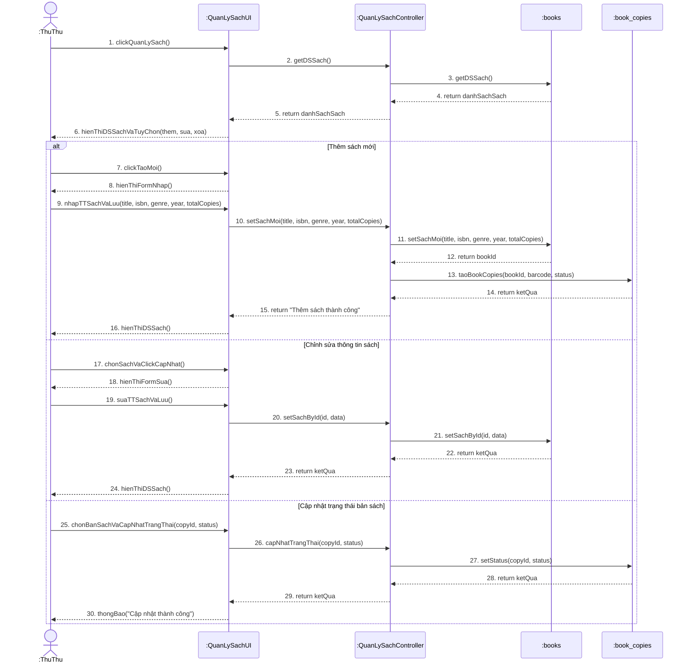

#### 2.3.2.1. Biểu đồ trình tự – Quản lý sách

```mermaid
sequenceDiagram
    actor ThuThu as :ThuThu
    participant UI as :QuanLySachUI
    participant CTRL as :QuanLySachController
    participant B as :books
    participant BC as :book_copies

    ThuThu->>UI: 1. clickQuanLySach()
    UI->>CTRL: 2. getDSSach()
    CTRL->>B: 3. getDSSach()
    B-->>CTRL: 4. return danhSachSach
    CTRL-->>UI: 5. return danhSachSach
    UI-->>ThuThu: 6. hienThiDSSachVaTuyChon(them, sua, xoa)

    alt Thêm sách mới
        ThuThu->>UI: 7. clickTaoMoi()
        UI-->>ThuThu: 8. hienThiFormNhap()
        ThuThu->>UI: 9. nhapTTSachVaLuu(title, isbn, genre, year, totalCopies)
        UI->>CTRL: 10. setSachMoi(title, isbn, genre, year, totalCopies)
        CTRL->>B: 11. setSachMoi(title, isbn, genre, year, totalCopies)
        B-->>CTRL: 12. return bookId
        CTRL->>BC: 13. taoBookCopies(bookId, barcode, status)
        BC-->>CTRL: 14. return ketQua
        CTRL-->>UI: 15. return "Thêm sách thành công"
        UI-->>ThuThu: 16. hienThiDSSach()
    else Chỉnh sửa thông tin sách
        ThuThu->>UI: 17. chonSachVaClickCapNhat()
        UI-->>ThuThu: 18. hienThiFormSua()
        ThuThu->>UI: 19. suaTTSachVaLuu()
        UI->>CTRL: 20. setSachById(id, data)
        CTRL->>B: 21. setSachById(id, data)
        B-->>CTRL: 22. return ketQua
        CTRL-->>UI: 23. return ketQua
        UI-->>ThuThu: 24. hienThiDSSach()
    else Cập nhật trạng thái bản sách
        ThuThu->>UI: 25. chonBanSachVaCapNhatTrangThai(copyId, status)
        UI->>CTRL: 26. capNhatTrangThai(copyId, status)
        CTRL->>BC: 27. setStatus(copyId, status)
        BC-->>CTRL: 28. return ketQua
        CTRL-->>UI: 29. return ketQua
        UI-->>ThuThu: 30. thongBao("Cập nhật thành công")
    end
```

*Hình 2.6. Biểu đồ trình tự – Quản lý sách*
