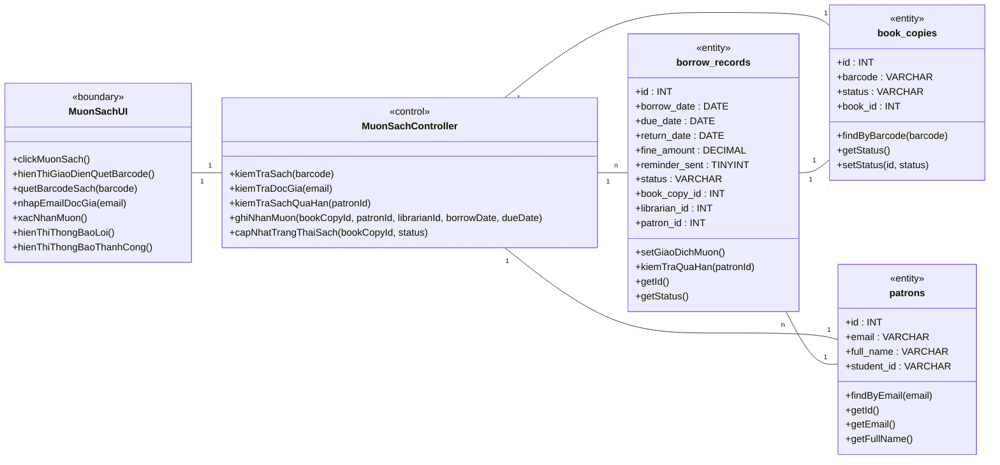

#### 2.3.3.2. Biểu đồ lớp phân tích – Quét sách khi mượn

```mermaid
classDiagram
    direction LR
    class MuonSachUI {
        <<boundary>>
        +clickMuonSach()
        +hienThiGiaoDienQuetBarcode()
        +quetBarcodeSach(barcode)
        +nhapEmailDocGia(email)
        +xacNhanMuon()
        +hienThiThongBaoLoi()
        +hienThiThongBaoThanhCong()
    }
    class MuonSachController {
        <<control>>
        +kiemTraSach(barcode)
        +kiemTraDocGia(email)
        +kiemTraSachQuaHan(patronId)
        +ghiNhanMuon(bookCopyId, patronId, librarianId, borrowDate, dueDate)
        +capNhatTrangThaiSach(bookCopyId, status)
    }
    class book_copies {
        <<entity>>
        +id : INT
        +barcode : VARCHAR
        +status : VARCHAR
        +book_id : INT
        +findByBarcode(barcode)
        +getStatus()
        +setStatus(id, status)
    }
    class patrons {
        <<entity>>
        +id : INT
        +email : VARCHAR
        +full_name : VARCHAR
        +student_id : VARCHAR
        +findByEmail(email)
        +getId()
        +getEmail()
        +getFullName()
    }
    class borrow_records {
        <<entity>>
        +id : INT
        +borrow_date : DATE
        +due_date : DATE
        +return_date : DATE
        +fine_amount : DECIMAL
        +reminder_sent : TINYINT
        +status : VARCHAR
        +book_copy_id : INT
        +librarian_id : INT
        +patron_id : INT
        +setGiaoDichMuon()
        +kiemTraQuaHan(patronId)
        +getId()
        +getStatus()
    }
    MuonSachUI "1" -- "1" MuonSachController
    MuonSachController "1" -- "1" book_copies
    MuonSachController "1" -- "1" patrons
    MuonSachController "1" -- "n" borrow_records
    borrow_records "n" -- "1" patrons
    borrow_records "1" -- "1" book_copies
```

*Hình 2.9. Biểu đồ lớp phân tích – Quét sách khi mượn*
