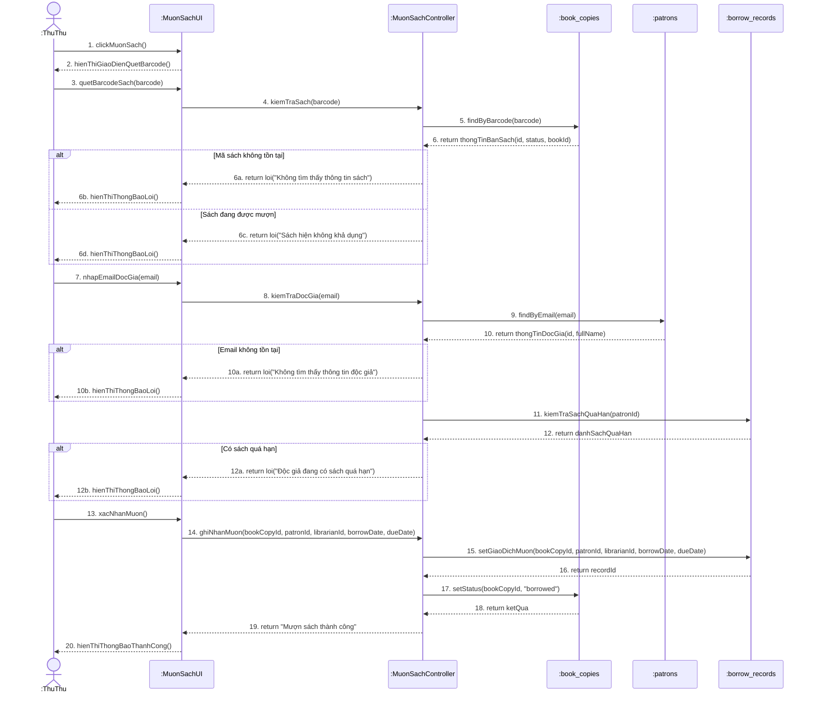

#### 2.3.3.1. Biểu đồ trình tự – Quét sách khi mượn

```mermaid
sequenceDiagram
    actor ThuThu as :ThuThu
    participant UI as :MuonSachUI
    participant CTRL as :MuonSachController
    participant BC as :book_copies
    participant P as :patrons
    participant BR as :borrow_records

    ThuThu->>UI: 1. clickMuonSach()
    UI-->>ThuThu: 2. hienThiGiaoDienQuetBarcode()
    ThuThu->>UI: 3. quetBarcodeSach(barcode)
    UI->>CTRL: 4. kiemTraSach(barcode)
    CTRL->>BC: 5. findByBarcode(barcode)
    BC-->>CTRL: 6. return thongTinBanSach(id, status, bookId)
    alt Mã sách không tồn tại
        CTRL-->>UI: 6a. return loi("Không tìm thấy thông tin sách")
        UI-->>ThuThu: 6b. hienThiThongBaoLoi()
    else Sách đang được mượn
        CTRL-->>UI: 6c. return loi("Sách hiện không khả dụng")
        UI-->>ThuThu: 6d. hienThiThongBaoLoi()
    end
    ThuThu->>UI: 7. nhapEmailDocGia(email)
    UI->>CTRL: 8. kiemTraDocGia(email)
    CTRL->>P: 9. findByEmail(email)
    P-->>CTRL: 10. return thongTinDocGia(id, fullName)
    alt Email không tồn tại
        CTRL-->>UI: 10a. return loi("Không tìm thấy thông tin độc giả")
        UI-->>ThuThu: 10b. hienThiThongBaoLoi()
    end
    CTRL->>BR: 11. kiemTraSachQuaHan(patronId)
    BR-->>CTRL: 12. return danhSachQuaHan
    alt Có sách quá hạn
        CTRL-->>UI: 12a. return loi("Độc giả đang có sách quá hạn")
        UI-->>ThuThu: 12b. hienThiThongBaoLoi()
    end
    ThuThu->>UI: 13. xacNhanMuon()
    UI->>CTRL: 14. ghiNhanMuon(bookCopyId, patronId, librarianId, borrowDate, dueDate)
    CTRL->>BR: 15. setGiaoDichMuon(bookCopyId, patronId, librarianId, borrowDate, dueDate)
    BR-->>CTRL: 16. return recordId
    CTRL->>BC: 17. setStatus(bookCopyId, "borrowed")
    BC-->>CTRL: 18. return ketQua
    CTRL-->>UI: 19. return "Mượn sách thành công"
    UI-->>ThuThu: 20. hienThiThongBaoThanhCong()
```

*Hình 2.8. Biểu đồ trình tự – Quét sách khi mượn*
