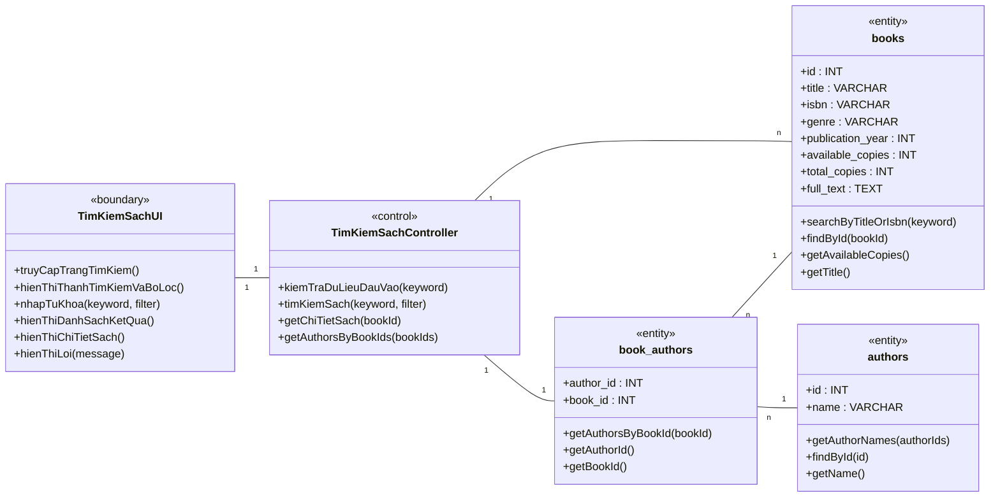

#### 2.3.4.2. Biểu đồ lớp phân tích – Tìm kiếm sách

```mermaid
classDiagram
    direction LR
    class TimKiemSachUI {
        <<boundary>>
        +truyCapTrangTimKiem()
        +hienThiThanhTimKiemVaBoLoc()
        +nhapTuKhoa(keyword, filter)
        +hienThiDanhSachKetQua()
        +hienThiChiTietSach()
        +hienThiLoi(message)
    }
    class TimKiemSachController {
        <<control>>
        +kiemTraDuLieuDauVao(keyword)
        +timKiemSach(keyword, filter)
        +getChiTietSach(bookId)
        +getAuthorsByBookIds(bookIds)
    }
    class books {
        <<entity>>
        +id : INT
        +title : VARCHAR
        +isbn : VARCHAR
        +genre : VARCHAR
        +publication_year : INT
        +available_copies : INT
        +total_copies : INT
        +full_text : TEXT
        +searchByTitleOrIsbn(keyword)
        +findById(bookId)
        +getAvailableCopies()
        +getTitle()
    }
    class book_authors {
        <<entity>>
        +author_id : INT
        +book_id : INT
        +getAuthorsByBookId(bookId)
        +getAuthorId()
        +getBookId()
    }
    class authors {
        <<entity>>
        +id : INT
        +name : VARCHAR
        +getAuthorNames(authorIds)
        +findById(id)
        +getName()
    }
    TimKiemSachUI "1" -- "1" TimKiemSachController
    TimKiemSachController "1" -- "n" books
    TimKiemSachController "1" -- "1" book_authors
    book_authors "n" -- "1" authors
    book_authors "n" -- "1" books
```

*Hình 2.11. Biểu đồ lớp phân tích – Tìm kiếm sách*
