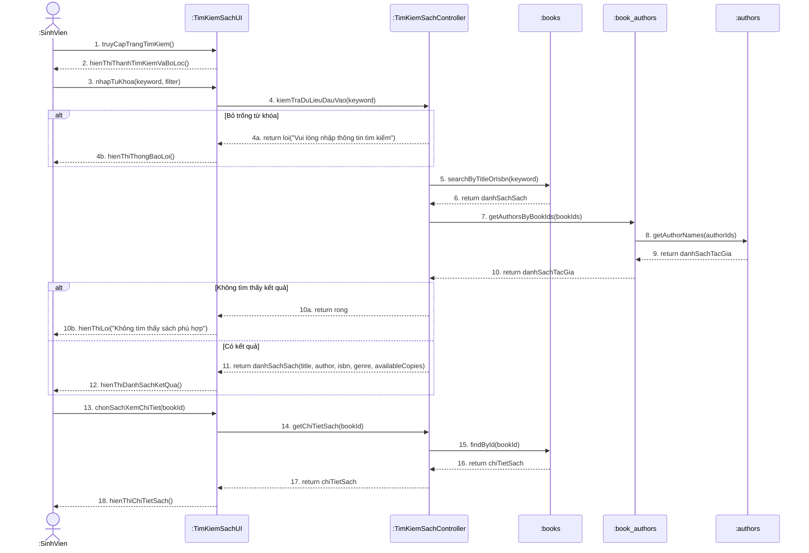

#### 2.3.4.1. Biểu đồ trình tự – Tìm kiếm sách

```mermaid
sequenceDiagram
    actor SinhVien as :SinhVien
    participant UI as :TimKiemSachUI
    participant CTRL as :TimKiemSachController
    participant B as :books
    participant BA as :book_authors
    participant A as :authors

    SinhVien->>UI: 1. truyCapTrangTimKiem()
    UI-->>SinhVien: 2. hienThiThanhTimKiemVaBoLoc()
    SinhVien->>UI: 3. nhapTuKhoa(keyword, filter)
    UI->>CTRL: 4. kiemTraDuLieuDauVao(keyword)
    alt Bỏ trống từ khóa
        CTRL-->>UI: 4a. return loi("Vui lòng nhập thông tin tìm kiếm")
        UI-->>SinhVien: 4b. hienThiThongBaoLoi()
    end
    CTRL->>B: 5. searchByTitleOrIsbn(keyword)
    B-->>CTRL: 6. return danhSachSach
    CTRL->>BA: 7. getAuthorsByBookIds(bookIds)
    BA->>A: 8. getAuthorNames(authorIds)
    A-->>BA: 9. return danhSachTacGia
    BA-->>CTRL: 10. return danhSachTacGia
    alt Không tìm thấy kết quả
        CTRL-->>UI: 10a. return rong
        UI-->>SinhVien: 10b. hienThiLoi("Không tìm thấy sách phù hợp")
    else Có kết quả
        CTRL-->>UI: 11. return danhSachSach(title, author, isbn, genre, availableCopies)
        UI-->>SinhVien: 12. hienThiDanhSachKetQua()
    end
    SinhVien->>UI: 13. chonSachXemChiTiet(bookId)
    UI->>CTRL: 14. getChiTietSach(bookId)
    CTRL->>B: 15. findById(bookId)
    B-->>CTRL: 16. return chiTietSach
    CTRL-->>UI: 17. return chiTietSach
    UI-->>SinhVien: 18. hienThiChiTietSach()
```

*Hình 2.10. Biểu đồ trình tự – Tìm kiếm sách*
