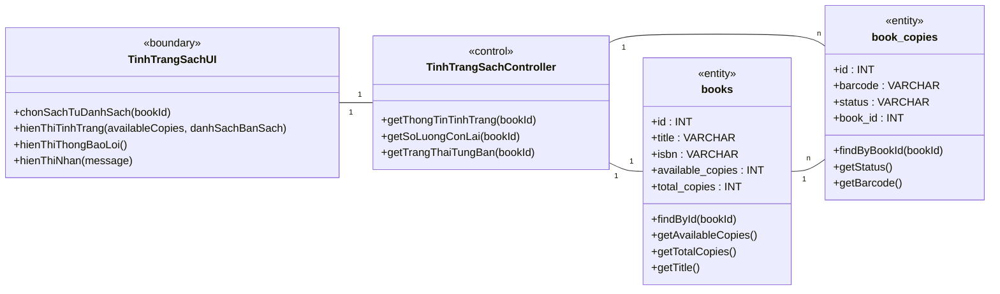

#### 2.3.5.2. Biểu đồ lớp phân tích – Xem tình trạng sách

```mermaid
classDiagram
    direction LR
    class TinhTrangSachUI {
        <<boundary>>
        +chonSachTuDanhSach(bookId)
        +hienThiTinhTrang(availableCopies, danhSachBanSach)
        +hienThiThongBaoLoi()
        +hienThiNhan(message)
    }
    class TinhTrangSachController {
        <<control>>
        +getThongTinTinhTrang(bookId)
        +getSoLuongConLai(bookId)
        +getTrangThaiTungBan(bookId)
    }
    class books {
        <<entity>>
        +id : INT
        +title : VARCHAR
        +isbn : VARCHAR
        +available_copies : INT
        +total_copies : INT
        +findById(bookId)
        +getAvailableCopies()
        +getTotalCopies()
        +getTitle()
    }
    class book_copies {
        <<entity>>
        +id : INT
        +barcode : VARCHAR
        +status : VARCHAR
        +book_id : INT
        +findByBookId(bookId)
        +getStatus()
        +getBarcode()
    }
    TinhTrangSachUI "1" -- "1" TinhTrangSachController
    TinhTrangSachController "1" -- "1" books
    TinhTrangSachController "1" -- "n" book_copies
    books "1" -- "n" book_copies
```

*Hình 2.13. Biểu đồ lớp phân tích – Xem tình trạng sách*
