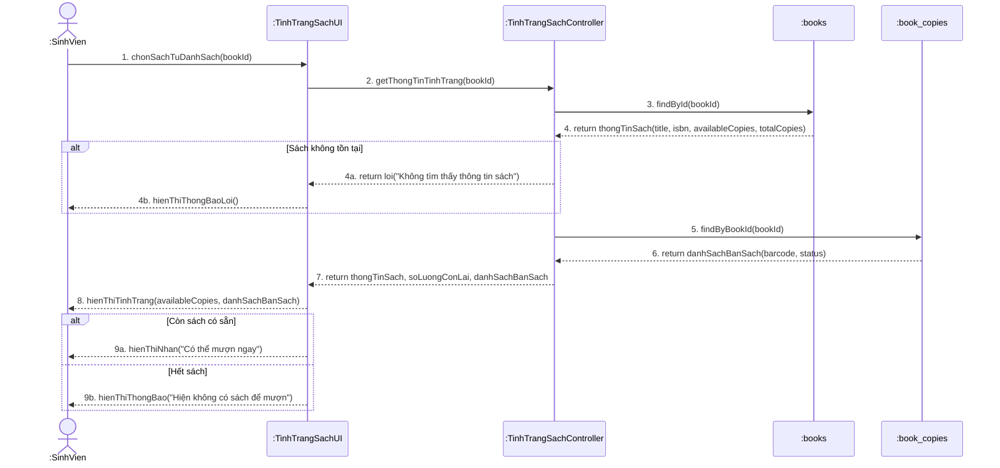

#### 2.3.5.1. Biểu đồ trình tự – Xem tình trạng sách

```mermaid
sequenceDiagram
    actor SinhVien as :SinhVien
    participant UI as :TinhTrangSachUI
    participant CTRL as :TinhTrangSachController
    participant B as :books
    participant BC as :book_copies

    SinhVien->>UI: 1. chonSachTuDanhSach(bookId)
    UI->>CTRL: 2. getThongTinTinhTrang(bookId)
    CTRL->>B: 3. findById(bookId)
    B-->>CTRL: 4. return thongTinSach(title, isbn, availableCopies, totalCopies)
    alt Sách không tồn tại
        CTRL-->>UI: 4a. return loi("Không tìm thấy thông tin sách")
        UI-->>SinhVien: 4b. hienThiThongBaoLoi()
    end
    CTRL->>BC: 5. findByBookId(bookId)
    BC-->>CTRL: 6. return danhSachBanSach(barcode, status)
    CTRL-->>UI: 7. return thongTinSach, soLuongConLai, danhSachBanSach
    UI-->>SinhVien: 8. hienThiTinhTrang(availableCopies, danhSachBanSach)
    alt Còn sách có sẵn
        UI-->>SinhVien: 9a. hienThiNhan("Có thể mượn ngay")
    else Hết sách
        UI-->>SinhVien: 9b. hienThiThongBao("Hiện không có sách để mượn")
    end
```

*Hình 2.12. Biểu đồ trình tự – Xem tình trạng sách*
