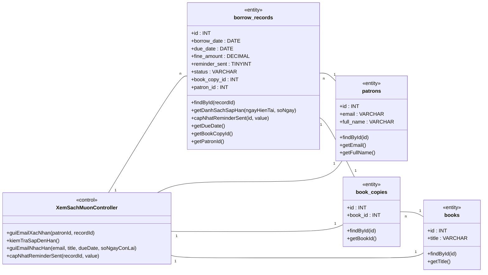

#### 2.3.6.2. Biểu đồ lớp phân tích – Xem sách đang mượn

```mermaid
classDiagram
    direction LR
    class XemSachMuonController {
        <<control>>
        +guiEmailXacNhan(patronId, recordId)
        +kiemTraSapDenHan()
        +guiEmailNhacHan(email, title, dueDate, soNgayConLai)
        +capNhatReminderSent(recordId, value)
    }
    class borrow_records {
        <<entity>>
        +id : INT
        +borrow_date : DATE
        +due_date : DATE
        +fine_amount : DECIMAL
        +reminder_sent : TINYINT
        +status : VARCHAR
        +book_copy_id : INT
        +patron_id : INT
        +findById(recordId)
        +getDanhSachSapHan(ngayHienTai, soNgay)
        +capNhatReminderSent(id, value)
        +getDueDate()
        +getBookCopyId()
        +getPatronId()
    }
    class patrons {
        <<entity>>
        +id : INT
        +email : VARCHAR
        +full_name : VARCHAR
        +findById(id)
        +getEmail()
        +getFullName()
    }
    class book_copies {
        <<entity>>
        +id : INT
        +book_id : INT
        +findById(id)
        +getBookId()
    }
    class books {
        <<entity>>
        +id : INT
        +title : VARCHAR
        +findById(id)
        +getTitle()
    }
    XemSachMuonController "1" -- "n" borrow_records
    XemSachMuonController "1" -- "1" patrons
    XemSachMuonController "1" -- "1" book_copies
    XemSachMuonController "1" -- "1" books
    borrow_records "n" -- "1" patrons
    borrow_records "1" -- "1" book_copies
    book_copies "n" -- "1" books
```

*Hình 2.15. Biểu đồ lớp phân tích – Xem sách đang mượn*
