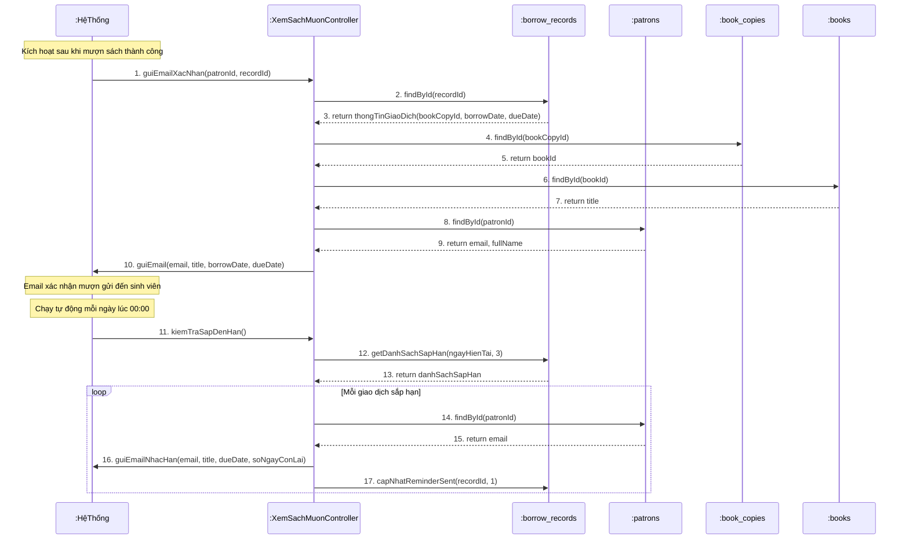

#### 2.3.6.1. Biểu đồ trình tự – Xem sách đang mượn

```mermaid
sequenceDiagram
    participant HT as :HệThống
    participant CTRL as :XemSachMuonController
    participant BR as :borrow_records
    participant P as :patrons
    participant BC as :book_copies
    participant B as :books

    Note over HT: Kích hoạt sau khi mượn sách thành công
    HT->>CTRL: 1. guiEmailXacNhan(patronId, recordId)
    CTRL->>BR: 2. findById(recordId)
    BR-->>CTRL: 3. return thongTinGiaoDich(bookCopyId, borrowDate, dueDate)
    CTRL->>BC: 4. findById(bookCopyId)
    BC-->>CTRL: 5. return bookId
    CTRL->>B: 6. findById(bookId)
    B-->>CTRL: 7. return title
    CTRL->>P: 8. findById(patronId)
    P-->>CTRL: 9. return email, fullName
    CTRL->>HT: 10. guiEmail(email, title, borrowDate, dueDate)
    Note over HT: Email xác nhận mượn gửi đến sinh viên

    Note over HT: Chạy tự động mỗi ngày lúc 00:00
    HT->>CTRL: 11. kiemTraSapDenHan()
    CTRL->>BR: 12. getDanhSachSapHan(ngayHienTai, 3)
    BR-->>CTRL: 13. return danhSachSapHan
    loop Mỗi giao dịch sắp hạn
        CTRL->>P: 14. findById(patronId)
        P-->>CTRL: 15. return email
        CTRL->>HT: 16. guiEmailNhacHan(email, title, dueDate, soNgayConLai)
        CTRL->>BR: 17. capNhatReminderSent(recordId, 1)
    end
```

*Hình 2.14. Biểu đồ trình tự – Xem sách đang mượn*
