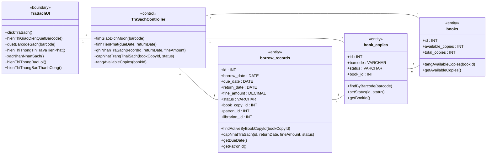

#### 2.3.7.2. Biểu đồ lớp phân tích – Nhận trả sách

```mermaid
classDiagram
    direction LR
    class TraSachUI {
        <<boundary>>
        +clickTraSach()
        +hienThiGiaoDienQuetBarcode()
        +quetBarcodeSach(barcode)
        +hienThiThongTinTraVaTienPhat()
        +xacNhanNhanSach()
        +hienThiThongBaoLoi()
        +hienThiThongBaoThanhCong()
    }
    class TraSachController {
        <<control>>
        +timGiaoDichMuon(barcode)
        +tinhTienPhat(dueDate, returnDate)
        +ghiNhanTraSach(recordId, returnDate, fineAmount)
        +capNhatTrangThaiSach(bookCopyId, status)
        +tangAvailableCopies(bookId)
    }
    class book_copies {
        <<entity>>
        +id : INT
        +barcode : VARCHAR
        +status : VARCHAR
        +book_id : INT
        +findByBarcode(barcode)
        +setStatus(id, status)
        +getBookId()
    }
    class borrow_records {
        <<entity>>
        +id : INT
        +borrow_date : DATE
        +due_date : DATE
        +return_date : DATE
        +fine_amount : DECIMAL
        +status : VARCHAR
        +book_copy_id : INT
        +patron_id : INT
        +librarian_id : INT
        +findActiveByBookCopyId(bookCopyId)
        +capNhatTraSach(id, returnDate, fineAmount, status)
        +getDueDate()
        +getPatronId()
    }
    class books {
        <<entity>>
        +id : INT
        +available_copies : INT
        +total_copies : INT
        +tangAvailableCopies(bookId)
        +getAvailableCopies()
    }
    TraSachUI "1" -- "1" TraSachController
    TraSachController "1" -- "1" book_copies
    TraSachController "1" -- "1" borrow_records
    TraSachController "1" -- "1" books
    borrow_records "1" -- "1" book_copies
    book_copies "n" -- "1" books
```

*Hình 2.17. Biểu đồ lớp phân tích – Nhận trả sách*
