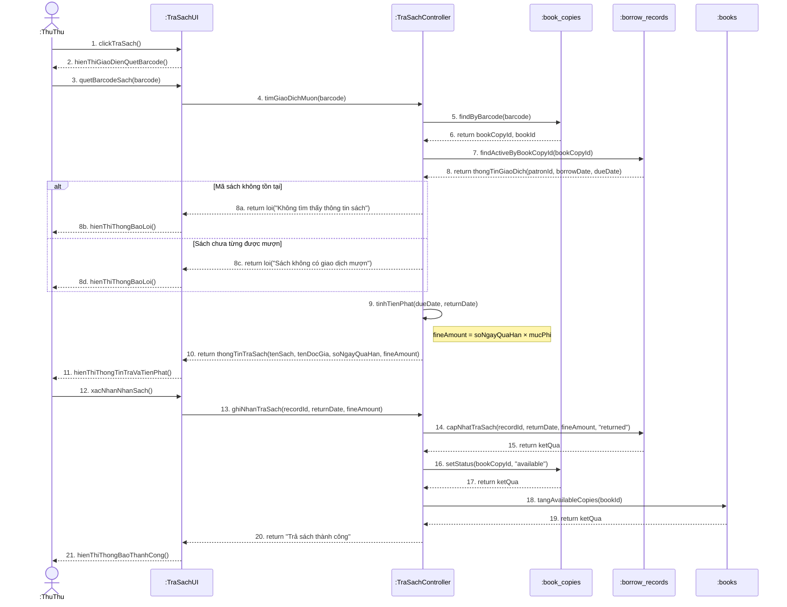

#### 2.3.7.1. Biểu đồ trình tự – Nhận trả sách

```mermaid
sequenceDiagram
    actor ThuThu as :ThuThu
    participant UI as :TraSachUI
    participant CTRL as :TraSachController
    participant BC as :book_copies
    participant BR as :borrow_records
    participant B as :books

    ThuThu->>UI: 1. clickTraSach()
    UI-->>ThuThu: 2. hienThiGiaoDienQuetBarcode()
    ThuThu->>UI: 3. quetBarcodeSach(barcode)
    UI->>CTRL: 4. timGiaoDichMuon(barcode)
    CTRL->>BC: 5. findByBarcode(barcode)
    BC-->>CTRL: 6. return bookCopyId, bookId
    CTRL->>BR: 7. findActiveByBookCopyId(bookCopyId)
    BR-->>CTRL: 8. return thongTinGiaoDich(patronId, borrowDate, dueDate)
    alt Mã sách không tồn tại
        CTRL-->>UI: 8a. return loi("Không tìm thấy thông tin sách")
        UI-->>ThuThu: 8b. hienThiThongBaoLoi()
    else Sách chưa từng được mượn
        CTRL-->>UI: 8c. return loi("Sách không có giao dịch mượn")
        UI-->>ThuThu: 8d. hienThiThongBaoLoi()
    end
    CTRL->>CTRL: 9. tinhTienPhat(dueDate, returnDate)
    Note right of CTRL: fineAmount = soNgayQuaHan × mucPhi
    CTRL-->>UI: 10. return thongTinTraSach(tenSach, tenDocGia, soNgayQuaHan, fineAmount)
    UI-->>ThuThu: 11. hienThiThongTinTraVaTienPhat()
    ThuThu->>UI: 12. xacNhanNhanSach()
    UI->>CTRL: 13. ghiNhanTraSach(recordId, returnDate, fineAmount)
    CTRL->>BR: 14. capNhatTraSach(recordId, returnDate, fineAmount, "returned")
    BR-->>CTRL: 15. return ketQua
    CTRL->>BC: 16. setStatus(bookCopyId, "available")
    BC-->>CTRL: 17. return ketQua
    CTRL->>B: 18. tangAvailableCopies(bookId)
    B-->>CTRL: 19. return ketQua
    CTRL-->>UI: 20. return "Trả sách thành công"
    UI-->>ThuThu: 21. hienThiThongBaoThanhCong()
```

*Hình 2.16. Biểu đồ trình tự – Nhận trả sách*
