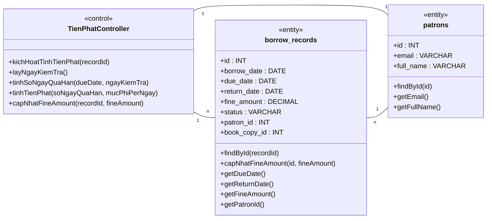

#### 2.3.8.2. Biểu đồ lớp phân tích – Tự động tính tiền phạt

```mermaid
classDiagram
    direction LR
    class TienPhatController {
        <<control>>
        +kichHoatTinhTienPhat(recordId)
        +layNgayKiemTra()
        +tinhSoNgayQuaHan(dueDate, ngayKiemTra)
        +tinhTienPhat(soNgayQuaHan, mucPhiPerNgay)
        +capNhatFineAmount(recordId, fineAmount)
    }
    class borrow_records {
        <<entity>>
        +id : INT
        +borrow_date : DATE
        +due_date : DATE
        +return_date : DATE
        +fine_amount : DECIMAL
        +status : VARCHAR
        +patron_id : INT
        +book_copy_id : INT
        +findById(recordId)
        +capNhatFineAmount(id, fineAmount)
        +getDueDate()
        +getReturnDate()
        +getFineAmount()
        +getPatronId()
    }
    class patrons {
        <<entity>>
        +id : INT
        +email : VARCHAR
        +full_name : VARCHAR
        +findById(id)
        +getEmail()
        +getFullName()
    }
    TienPhatController "1" -- "n" borrow_records
    TienPhatController "1" -- "1" patrons
    borrow_records "n" -- "1" patrons
```

*Hình 2.19. Biểu đồ lớp phân tích – Tự động tính tiền phạt*
