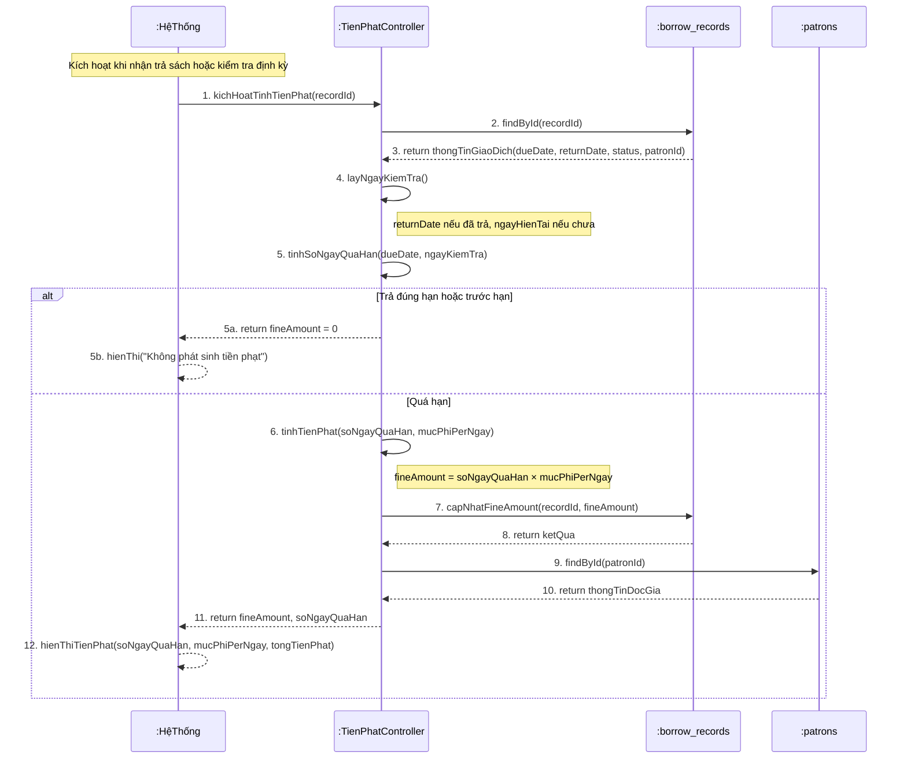

#### 2.3.8.1. Biểu đồ trình tự – Tự động tính tiền phạt

```mermaid
sequenceDiagram
    participant HT as :HệThống
    participant CTRL as :TienPhatController
    participant BR as :borrow_records
    participant P as :patrons

    Note over HT: Kích hoạt khi nhận trả sách hoặc kiểm tra định kỳ
    HT->>CTRL: 1. kichHoatTinhTienPhat(recordId)
    CTRL->>BR: 2. findById(recordId)
    BR-->>CTRL: 3. return thongTinGiaoDich(dueDate, returnDate, status, patronId)
    CTRL->>CTRL: 4. layNgayKiemTra()
    Note right of CTRL: returnDate nếu đã trả, ngayHienTai nếu chưa
    CTRL->>CTRL: 5. tinhSoNgayQuaHan(dueDate, ngayKiemTra)
    alt Trả đúng hạn hoặc trước hạn
        CTRL-->>HT: 5a. return fineAmount = 0
        HT-->>HT: 5b. hienThi("Không phát sinh tiền phạt")
    else Quá hạn
        CTRL->>CTRL: 6. tinhTienPhat(soNgayQuaHan, mucPhiPerNgay)
        Note right of CTRL: fineAmount = soNgayQuaHan × mucPhiPerNgay
        CTRL->>BR: 7. capNhatFineAmount(recordId, fineAmount)
        BR-->>CTRL: 8. return ketQua
        CTRL->>P: 9. findById(patronId)
        P-->>CTRL: 10. return thongTinDocGia
        CTRL-->>HT: 11. return fineAmount, soNgayQuaHan
        HT-->>HT: 12. hienThiTienPhat(soNgayQuaHan, mucPhiPerNgay, tongTienPhat)
    end
```

*Hình 2.18. Biểu đồ trình tự – Tự động tính tiền phạt*
