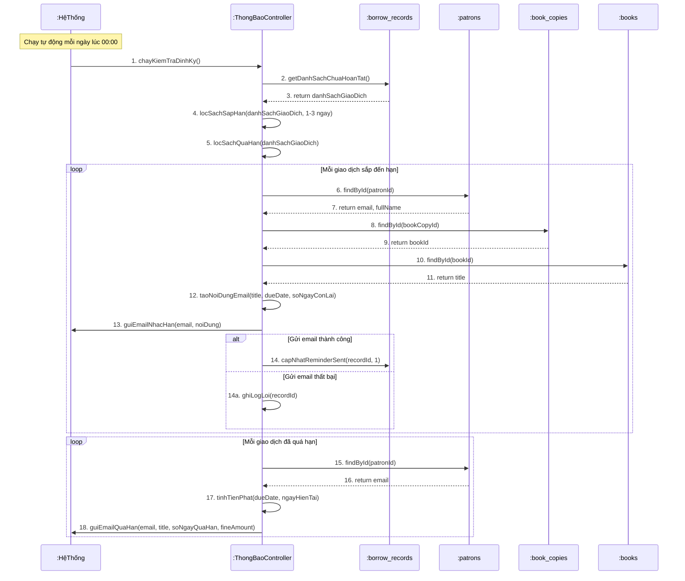

#### 2.3.9.1. Biểu đồ trình tự – Tự động thông báo nhắc hạn trả sách

```mermaid
sequenceDiagram
    participant HT as :HệThống
    participant CTRL as :ThongBaoController
    participant BR as :borrow_records
    participant P as :patrons
    participant BC as :book_copies
    participant B as :books

    Note over HT: Chạy tự động mỗi ngày lúc 00:00
    HT->>CTRL: 1. chayKiemTraDinhKy()
    CTRL->>BR: 2. getDanhSachChuaHoanTat()
    BR-->>CTRL: 3. return danhSachGiaoDich
    CTRL->>CTRL: 4. locSachSapHan(danhSachGiaoDich, 1-3 ngay)
    CTRL->>CTRL: 5. locSachQuaHan(danhSachGiaoDich)

    loop Mỗi giao dịch sắp đến hạn
        CTRL->>P: 6. findById(patronId)
        P-->>CTRL: 7. return email, fullName
        CTRL->>BC: 8. findById(bookCopyId)
        BC-->>CTRL: 9. return bookId
        CTRL->>B: 10. findById(bookId)
        B-->>CTRL: 11. return title
        CTRL->>CTRL: 12. taoNoiDungEmail(title, dueDate, soNgayConLai)
        CTRL->>HT: 13. guiEmailNhacHan(email, noiDung)
        alt Gửi email thành công
            CTRL->>BR: 14. capNhatReminderSent(recordId, 1)
        else Gửi email thất bại
            CTRL->>CTRL: 14a. ghiLogLoi(recordId)
        end
    end

    loop Mỗi giao dịch đã quá hạn
        CTRL->>P: 15. findById(patronId)
        P-->>CTRL: 16. return email
        CTRL->>CTRL: 17. tinhTienPhat(dueDate, ngayHienTai)
        CTRL->>HT: 18. guiEmailQuaHan(email, title, soNgayQuaHan, fineAmount)
    end
```

*Hình 2.20. Biểu đồ trình tự – Tự động thông báo nhắc hạn trả sách*
