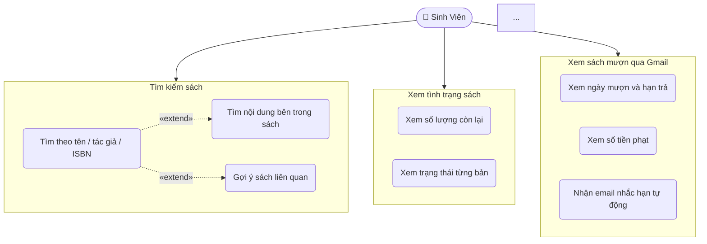

```mermaid
flowchart TB
    SV(["👤 Sinh Viên"])

    SV --> TK & TS & XM

    subgraph TK ["Tìm kiếm sách"]
        tk1(Tìm theo tên / tác giả / ISBN)
        tk2(Tìm nội dung bên trong sách)
        tk3(Gợi ý sách liên quan)
    end

    subgraph TS ["Xem tình trạng sách"]
        ts1(Xem số lượng còn lại)
        ts2(Xem trạng thái từng bản)
    end

    subgraph XM ["Xem sách mượn qua Gmail"]
        xm1(Xem ngày mượn và hạn trả)
        xm2(Xem số tiền phạt)
        xm3(Nhận email nhắc hạn tự động)
    end

    tk1 -.->|«extend»| tk2
    tk1 -.->|«extend»| tk3
    ...
```