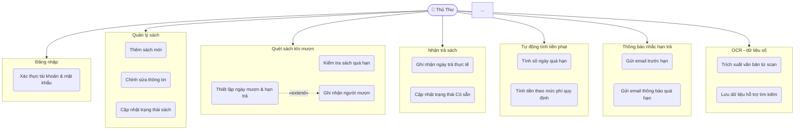

```mermaid
flowchart TB
    TT(["👤 Thủ Thư"])

    TT --> DN & QL & QS & NT & PH & TB_mail & OCR

    subgraph DN ["Đăng nhập"]
        dn1(Xác thực tài khoản & mật khẩu)
    end

    subgraph QL ["Quản lý sách"]
        ql1(Thêm sách mới)
        ql2(Chỉnh sửa thông tin)
        ql3(Cập nhật trạng thái sách)
    end

    subgraph QS ["Quét sách khi mượn"]
        qs1(Kiểm tra sách quá hạn)
        qs2(Thiết lập ngày mượn & hạn trả)
        qs3(Ghi nhận người mượn)
    end

    subgraph NT ["Nhận trả sách"]
        nt1(Ghi nhận ngày trả thực tế)
        nt2(Cập nhật trạng thái Có sẵn)
    end

    subgraph PH ["Tự động tính tiền phạt"]
        ph1(Tính số ngày quá hạn)
        ph2(Tính tiền theo mức phí quy định)
    end

    subgraph TB_mail ["Thông báo nhắc hạn trả"]
        tb1(Gửi email trước hạn)
        tb2(Gửi email thông báo quá hạn)
    end

    subgraph OCR ["OCR - dữ liệu số"]
        ocr1(Trích xuất văn bản từ scan)
        ocr2(Lưu dữ liệu hỗ trợ tìm kiếm)
    end

    qs2 -.->|«extend»| qs3
    ...
```