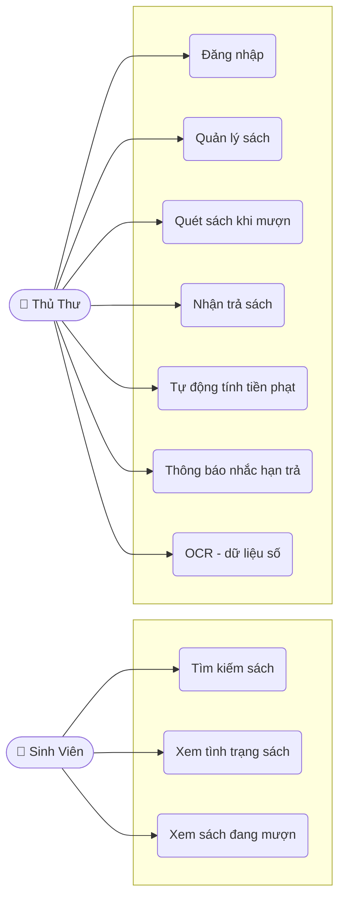

```mermaid
flowchart LR
    SV(["👤 Sinh Viên"])
    TT(["👤 Thủ Thư"])

    subgraph UC_SV ["  "]
        sv1(Tìm kiếm sách)
        sv2(Xem tình trạng sách)
        sv3(Xem sách đang mượn)
    end

    subgraph UC_TT ["  "]
        tt1(Đăng nhập)
        tt2(Quản lý sách)
        tt3(Quét sách khi mượn)
        tt4(Nhận trả sách)
        tt5(Tự động tính tiền phạt)
        tt6(Thông báo nhắc hạn trả)
        tt7(OCR - dữ liệu số)
    end

    SV --> sv1
    SV --> sv2
    SV --> sv3

    TT --> tt1
    TT --> tt2
    TT --> tt3
    TT --> tt4
    TT --> tt5
    TT --> tt6
    TT --> tt7
```