# MỞ ĐẦU

## 1. Lý do chọn đề tài

Trong bối cảnh chuyển đổi số quốc gia và xây dựng xã hội học tập suốt đời tại Việt Nam hiện nay, thư viện – đặc biệt là thư viện trường học, thư viện cộng đồng và thư viện công cộng – đóng vai trò quan trọng như một trung tâm tri thức, hỗ trợ giáo dục, nghiên cứu và phát triển văn hóa đọc. Tuy nhiên, thực tế cho thấy hầu hết các thư viện quy mô vừa và nhỏ vẫn đang sử dụng phương pháp quản lý truyền thống (sổ tay, phiếu mượn, Excel thủ công hoặc danh mục thẻ giấy), dẫn đến nhiều hạn chế nghiêm trọng:

- Quy trình mượn-trả sách tốn thời gian, dễ xảy ra sai sót ghi chép, mất mát thông tin hoặc trùng lặp dữ liệu.
- Khó kiểm soát chính xác tình trạng sách (còn trong kho, đang mượn, quá hạn, hỏng/mất), dẫn đến thất thoát tài nguyên và giảm hiệu quả sử dụng kho sách.
- Việc tra cứu, tìm kiếm sách cho bạn đọc (học sinh, sinh viên, cán bộ) mất nhiều công sức, thường phải kiểm tra thủ công trên kệ, gây bất tiện và làm giảm hứng thú đọc sách.
- Tính toán phạt quá hạn, thống kê báo cáo (sách phổ biến, tỷ lệ sử dụng, doanh thu phạt,…) thủ công tốn kém thời gian và dễ sai lệch.
- Thủ thư phải chịu áp lực lớn trong việc quản lý hàng nghìn đầu sách với nguồn nhân lực hạn chế, trong khi nhu cầu bạn đọc ngày càng tăng cao.

Những bất cập này không chỉ ảnh hưởng trực tiếp đến chất lượng phục vụ mà còn cản trở việc thúc đẩy văn hóa đọc – một trong những mục tiêu quan trọng của Chiến lược phát triển văn hóa đọc Việt Nam đến năm 2030.

Xuất phát từ thực tiễn trên, nhóm chọn đề tài **"Xây dựng hệ thống quản lý thư viện"** vì các lý do chính sau:

**Tính cấp thiết và thực tiễn cao:** Đề tài giải quyết trực tiếp vấn đề thực tế tại nhiều thư viện Việt Nam, đặc biệt thư viện trường học và cộng đồng – nơi nguồn lực công nghệ còn hạn chế nhưng nhu cầu số hóa đang tăng mạnh. Ví dụ điển hình là chia sẻ từ bà Mrs. Phelps (thủ thư trưởng một thư viện công cộng): hệ thống danh mục thẻ cũ kỹ, phải kiểm tra thủ công trên kệ, ghi tên mượn vào sổ tay, tính phạt quá hạn bằng cách đếm ngày trên lịch – đây chính là tình trạng phổ biến ở nhiều thư viện Việt Nam hiện nay.

**Ứng dụng công nghệ thông tin vào quản lý thư viện:** Đề tài cho phép áp dụng các kiến thức lập trình, cơ sở dữ liệu, thiết kế giao diện và tự động hóa quy trình – phù hợp với chương trình đào tạo Công nghệ thông tin/Khoa học máy tính. Việc xây dựng hệ thống sẽ giúp tự động hóa toàn bộ nghiệp vụ: quản lý sách (ISBN, tác giả, thể loại, vị trí kệ), quản lý bạn đọc, mượn-trả (hỗ trợ quét barcode/QR), tính phạt tự động, tra cứu trực tuyến, thông báo nhắc hạn trả (email/SMS), báo cáo thống kê.

**Góp phần thúc đẩy chuyển đổi số và văn hóa đọc:** Hệ thống không chỉ nâng cao hiệu suất quản lý, giảm áp lực cho thủ thư mà còn mang lại trải nghiệm tốt hơn cho bạn đọc (tìm kiếm nhanh, đặt mượn online, kiểm tra tình trạng sách từ xa). Điều này góp phần khuyến khích thói quen đọc sách, đặc biệt ở học sinh/sinh viên – đối tượng chính của nhiều thư viện trường học.

**Tính khả thi và giá trị học thuật:** Đề tài có phạm vi rõ ràng, dễ triển khai với công nghệ phổ biến (ví dụ: Python/Django + MySQL/PostgreSQL, hoặc PHP/Laravel, giao diện web-responsive), đồng thời có thể mở rộng sau này (tích hợp OCR số hóa sách hiếm, gợi ý sách dựa trên lịch sử mượn, liên kết đa thư viện). Kết quả có thể áp dụng thực tế tại trường học hoặc thư viện địa phương, mang lại giá trị ứng dụng cao.

**Phù hợp với xu hướng toàn cầu và Việt Nam:** Nhiều nước đã áp dụng Integrated Library System (ILS) để hiện đại hóa thư viện; tại Việt Nam, các chương trình chuyển đổi số giáo dục và văn hóa đang khuyến khích xây dựng hệ thống quản lý số cho thư viện. Đề tài này không chỉ đáp ứng yêu cầu học thuật mà còn có ý nghĩa xã hội thiết thực.

Tóm lại, việc chọn đề tài **"Xây dựng hệ thống quản lý thư viện"** xuất phát từ nhu cầu thực tiễn cấp bách, kết hợp giữa giá trị học thuật, kỹ thuật và đóng góp xã hội. Đề tài không chỉ giúp nhóm rèn luyện kỹ năng chuyên môn mà còn góp phần nhỏ vào việc hiện đại hóa quản lý thư viện, thúc đẩy văn hóa đọc trong cộng đồng.

---

## 2. Mục tiêu nghiên cứu

Mục tiêu cốt lõi của đề tài là nghiên cứu và xây dựng một Hệ thống Quản lý Thư viện thông minh (Smart Library Management System) nhằm thay thế hoàn toàn phương thức quản lý thủ công hiện tại tại Central City Library. Trước hết, đề tài tập trung vào việc thiết lập một cơ sở dữ liệu số hóa toàn diện, nơi mọi thông tin về đầu sách như Tiêu đề, Tác giả, chỉ số ISBN và thông tin độc giả được lưu trữ tập trung. Việc này không chỉ giúp loại bỏ hệ thống thẻ mục lục lỗi thời mà còn cho phép sinh viên có thể tra cứu thông tin sách trực tuyến từ xa hoặc tại trạm máy tính, giúp họ biết ngay lập tức cuốn sách mình cần đang nằm trên kệ hay đã được mượn đi, từ đó tối ưu hóa thời gian cho cả người học và người quản lý.

Đi sâu vào nghiệp vụ vận hành, nghiên cứu hướng tới việc tự động hóa quy trình mượn và trả sách thông qua công nghệ nhận diện mã vạch (Barcode/QR Code). Thay vì ghi chép tay vào sổ cái rườm rà và dễ sai sót, hệ thống sẽ cho phép thủ thư quét mã để ghi nhận giao dịch tức thời, đồng thời tự động cập nhật trạng thái kho. Đặc biệt, đề tài chú trọng giải quyết vấn đề "ác mộng" về tài chính bằng cách tích hợp module quản lý quá hạn tự động. Hệ thống sẽ tự động tính toán số ngày trễ hạn dựa trên lịch thực tế và áp dụng mức phí phạt tương ứng, giúp xuất hóa đơn hoặc thông báo phạt một cách chính xác mà không cần đếm ngày thủ công trên lịch.

Bên cạnh các nghiệp vụ cơ bản, đề tài còn mang tính đột phá khi nghiên cứu ứng dụng các công nghệ hiện đại để nâng tầm thư viện. Cụ thể, hệ thống sẽ tích hợp thuật toán gợi ý tự động (Recommendation System) dựa trên hành vi người dùng; chẳng hạn, nếu một sinh viên thường xuyên mượn dòng sách giả tưởng như Harry Potter, hệ thống sẽ chủ động gợi ý các bộ sách tương đồng như Percy Jackson. Cuối cùng, một mục tiêu quan trọng và đầy tham vọng là nghiên cứu triển khai công nghệ Nhận dạng ký tự quang học (OCR). Công nghệ này sẽ được thử nghiệm để số hóa các bản thảo và sách cổ quý hiếm, chuyển đổi hình ảnh quét thành văn bản có thể tìm kiếm được, giúp bảo tồn di sản của thư viện và mở ra cơ hội tiếp cận tri thức quý giá cho độc giả trên nền tảng số.

---

## 3. Đối tượng nghiên cứu

Đối tượng nghiên cứu của đề tài là hệ thống quản lý thư viện trên nền tảng số, tập trung vào việc hỗ trợ và tự động hóa các nghiệp vụ quản lý thư viện truyền thống.

Cụ thể, đề tài nghiên cứu các đối tượng sau:

- **Độc giả (bạn đọc):** học sinh, sinh viên, giảng viên hoặc người dùng thư viện có nhu cầu tra cứu, mượn và trả sách.
- **Thủ thư:** người chịu trách nhiệm quản lý kho sách, xử lý nghiệp vụ mượn – trả, cập nhật thông tin sách và hỗ trợ độc giả.
- **Tài nguyên thư viện:** bao gồm sách, tài liệu, danh mục thể loại, tác giả và thông tin vị trí lưu trữ.
- **Hoạt động nghiệp vụ:** quy trình đăng ký độc giả, tra cứu sách, mượn – trả, gia hạn, tính phạt quá hạn và thống kê báo cáo.

Bên cạnh đó, đề tài cũng nghiên cứu việc ứng dụng công nghệ thông tin (cơ sở dữ liệu, giao diện web, tự động hóa quy trình) nhằm nâng cao hiệu quả quản lý và cải thiện trải nghiệm người dùng.

---

## 4. Phạm vi nghiên cứu

- Nghiên cứu, phân tích và xây dựng hệ thống Library Management System phục vụ Central City Library theo yêu cầu của Mrs. Phelps.
- Tập trung phát triển các chức năng: quản lý sách (Title, Author, ISBN, trạng thái), quản lý người mượn, tìm kiếm sách, hiển thị tình trạng còn/trả, quản lý mượn – trả bằng barcode và tự động tính tiền phạt trễ hạn.
- Không bao gồm các chức năng nâng cao như OCR số hóa sách hiếm, hệ thống gợi ý tự động hoặc thanh toán trực tuyến (chỉ định hướng phát triển tương lai).
- Phạm vi triển khai trong môi trường mô phỏng phục vụ mục đích học tập và thực hành.
- Thực hiện qua kênh Google Meet, thời gian từ 23/02/2026 và kéo dài 6 tuần.

---

## 5. Kết quả mong muốn đạt được

Việc triển khai hệ thống quản lý thư viện mới không chỉ là một bước đi công nghệ mà còn là một cuộc "cách mạng" trong trải nghiệm của cả thủ thư và độc giả tại Central City Library. Kết quả quan trọng nhất chính là việc thiết lập được một hệ thống cơ sở dữ liệu số hóa đồng bộ và toàn diện. Toàn bộ kho sách với hàng ngàn đầu mục sẽ được quản lý khoa học thông qua mã ISBN và hệ thống phân loại hiện đại. Điều này giúp loại bỏ hoàn toàn sự phụ thuộc vào thẻ mục lục giấy và sổ cái ghi tay, giảm thiểu tối đa các sai sót do con người gây ra và giúp việc kiểm kê kho định kỳ trở nên nhanh chóng, chính xác hơn bao giờ hết.

Về mặt vận hành, hệ thống sẽ mang lại sự đột phá trong hiệu suất quản lý mượn/trả. Với việc tích hợp công nghệ mã vạch, thời gian thực hiện một giao dịch mượn sách sẽ được rút ngắn từ vài phút xuống còn vài giây. Đặc biệt, bộ máy tính toán tự động sẽ giải quyết dứt điểm các tranh cãi về tiền phạt quá hạn nhờ tính minh bạch và chính xác tuyệt đối theo thời gian thực. Sinh viên sẽ có một cổng tra cứu trực tuyến (OPAC) thân thiện, cho phép họ tìm kiếm sách theo tên, tác giả hoặc chủ đề và biết ngay vị trí chính xác của cuốn sách trên kệ, từ đó nâng cao tính tự chủ và sự hài lòng của độc giả khi đến với thư viện.

Bên cạnh đó, dự án kỳ vọng sẽ tạo ra một nền tảng bảo tồn di sản kỹ thuật số thông qua ứng dụng OCR. Kết quả cụ thể là một kho tài liệu số cho các bản thảo hiếm, giúp độc giả có thể đọc và tìm kiếm từ khóa bên trong nội dung sách mà không cần tiếp xúc trực tiếp với hiện vật, giúp bảo vệ các cuốn sách cổ khỏi hư hại vật lý. Cuối cùng, hệ thống sẽ trở thành một "người tư vấn sách" thông minh thông qua các thuật toán gợi ý tự động. Việc cá nhân hóa trải nghiệm độc giả bằng những gợi ý sách phù hợp không chỉ giúp tăng tỷ lệ mượn sách mà còn nuôi dưỡng niềm đam mê đọc sách trong cộng đồng sinh viên, biến thư viện thành một trung tâm tri thức năng động và hiện đại.

---

## 6. Cấu trúc báo cáo

Báo cáo được tổ chức thành các chương chính như sau:

**Mở đầu:** Trình bày lý do chọn đề tài, mục tiêu nghiên cứu, đối tượng và phạm vi nghiên cứu, kết quả mong muốn đạt được và cấu trúc của báo cáo.

**Chương 1 – Khảo sát hệ thống:** Mô tả hoạt động của thư viện dưới góc độ độc giả và thủ thư, xác định các yêu cầu chức năng và phi chức năng của hệ thống.

**Chương 2 – Phân tích hệ thống:** Trình bày các biểu đồ use case, mô tả chi tiết nghiệp vụ, phân tích các use case và thiết kế cơ sở dữ liệu phục vụ hệ thống.

**Chương 3 – Thiết kế hệ thống:** Trình bày kiến trúc hệ thống, thiết kế giao diện và mô hình triển khai.

**Chương 4 – Kết luận và hướng phát triển:** Tổng kết kết quả đạt được, đánh giá hạn chế và đề xuất hướng mở rộng trong tương lai.

---

# CHƯƠNG 1: KHẢO SÁT HỆ THỐNG

## 1.1 Hoạt động của hệ thống dưới góc độ của độc giả

Dưới góc độ của Độc giả (Sinh viên), hệ thống quản lý thư viện được xây dựng nhằm hỗ trợ các hoạt động tra cứu, mượn tài liệu và quản lý thông tin cá nhân một cách nhanh chóng, chính xác và thuận tiện. Các hoạt động chính của hệ thống bao gồm:

### Quy trình Tìm kiếm sách

Độc giả nhập từ khóa tìm kiếm (Tên sách, Tác giả hoặc ISBN) vào ô tìm kiếm. Hệ thống truy vấn cơ sở dữ liệu và trả về danh sách kết quả phù hợp. Thông tin hiển thị bao gồm Tên sách, Tác giả, ISBN và Trạng thái (Có sẵn hoặc Đang mượn).

### Quy trình Xem tình trạng sách

Sau khi tìm thấy cuốn sách mong muốn, sinh viên có thể chọn xem tình trạng của sách. Hệ thống hiển thị thông tin chi tiết bao gồm số lượng sách còn lại trong thư viện, trạng thái của từng bản sách (có sẵn hoặc đang được mượn) và vị trí lưu trữ. Chức năng này giúp sinh viên biết được sách có thể mượn ngay hay cần chờ người khác trả.

### Quy trình Xem sách đang mượn

Sinh viên mượn sách tại thư viện và cung cấp địa chỉ Gmail khi thực hiện giao dịch mượn. Sau khi mượn thành công, hệ thống sẽ gửi thông báo đến Gmail của sinh viên, trong đó chứa thông tin chi tiết về các sách đã mượn như tên sách, ngày mượn, hạn trả và các lưu ý liên quan.

Trước khi đến hạn trả sách, hệ thống sẽ tự động gửi email nhắc hạn để sinh viên chủ động sắp xếp thời gian trả sách đúng hạn. Trong trường hợp quá hạn, email thông báo cũng có thể hiển thị số tiền phạt (nếu có). Thông qua các thông báo này, sinh viên có thể theo dõi tình trạng mượn sách của mình mà không cần đăng nhập vào hệ thống.

Từ góc độ của độc giả, hệ thống giúp thay thế phương pháp quản lý thủ công bằng sổ ghi chép trước đây, tăng tính chính xác, minh bạch và nâng cao trải nghiệm khi sử dụng thư viện.

---

## 1.2 Hoạt động của hệ thống dưới góc độ thủ thư

Dưới góc độ của Thủ thư (Admin), hệ thống quản lý thư viện được xây dựng nhằm hỗ trợ việc quản lý tài liệu, theo dõi quá trình mượn – trả sách và tự động hóa các công việc nghiệp vụ trong thư viện. Các hoạt động chính của hệ thống bao gồm:

### Quy trình Đăng nhập

Thủ thư truy cập hệ thống và nhập tên tài khoản cùng mật khẩu để đăng nhập. Hệ thống tiến hành xác thực thông tin với cơ sở dữ liệu người dùng. Nếu thông tin hợp lệ, hệ thống cho phép thủ thư truy cập vào giao diện quản trị để thực hiện các chức năng quản lý. Nếu thông tin không chính xác, hệ thống hiển thị thông báo lỗi và yêu cầu nhập lại.

### Quy trình Quản lý sách (cập nhật trạng thái sách)

Thủ thư truy cập chức năng Quản lý sách để thêm mới, chỉnh sửa hoặc cập nhật thông tin của các tài liệu trong thư viện. Các thông tin có thể được cập nhật bao gồm tên sách, tác giả, ISBN, mô tả nội dung, số lượng bản sách và trạng thái của sách. Khi có thay đổi như sách mới nhập về, sách bị hỏng hoặc bị mất, thủ thư có thể cập nhật trạng thái để hệ thống phản ánh chính xác tình trạng của tài liệu trong thư viện.

### Quy trình Quét sách khi mượn

Khi sinh viên đến mượn sách, thủ thư sử dụng chức năng quét mã sách (barcode hoặc mã định danh) để ghi nhận giao dịch mượn. Hệ thống cho phép thủ thư xác định người mượn, kiểm tra tình trạng tài khoản của sinh viên và kiểm tra xem sinh viên có sách quá hạn hay không. Nếu đủ điều kiện mượn, hệ thống ghi nhận giao dịch mượn, thiết lập ngày mượn và hạn trả, đồng thời cập nhật trạng thái sách thành "Đang mượn".

### Quy trình Nhận trả sách

Khi sinh viên trả sách, thủ thư sử dụng chức năng Nhận trả sách để cập nhật thông tin vào hệ thống. Hệ thống ghi nhận ngày trả thực tế, đồng thời cập nhật trạng thái của sách thành "Có sẵn" để các sinh viên khác có thể tiếp tục mượn.

### Quy trình Tự động tính tiền phạt

Trong trường hợp sinh viên trả sách sau thời hạn quy định, hệ thống sẽ tự động tính toán tiền phạt dựa trên số ngày quá hạn và mức phí đã được cấu hình trước. Thông tin tiền phạt sẽ được hiển thị để thủ thư thông báo cho sinh viên và ghi nhận vào hệ thống.

### Quy trình Tự động thông báo nhắc hạn trả sách

Hệ thống tự động kiểm tra các giao dịch mượn sách và gửi thông báo nhắc hạn trả đến sinh viên thông qua email trước khi đến hạn. Chức năng này giúp giảm tình trạng trả sách muộn và hỗ trợ thủ thư trong việc quản lý thời gian trả sách.

### Quy trình OCR – dữ liệu số

Đối với các tài liệu được số hóa, thủ thư có thể sử dụng chức năng OCR (Optical Character Recognition) để trích xuất nội dung văn bản từ hình ảnh hoặc file scan của sách. Dữ liệu sau khi được xử lý sẽ được lưu vào hệ thống, hỗ trợ cho chức năng tìm kiếm nội dung bên trong sách của sinh viên.

Từ góc độ của thủ thư, hệ thống giúp tự động hóa nhiều quy trình quản lý thư viện, giảm khối lượng công việc thủ công, tăng độ chính xác trong việc theo dõi tài liệu và nâng cao hiệu quả quản lý chung của thư viện.

---

## 1.3 Các yêu cầu chức năng

### 1.3.1 Chức năng dành cho độc giả

Hệ thống cung cấp các chức năng hỗ trợ độc giả sử dụng thư viện thuận tiện và hiệu quả:

**1. Tìm kiếm sách**

Hệ thống cho phép độc giả tìm kiếm sách trong thư viện thông qua các từ khóa như tên sách, tác giả hoặc ISBN. Sau khi nhập từ khóa, hệ thống sẽ truy vấn cơ sở dữ liệu và hiển thị danh sách các sách phù hợp. Ngoài ra, hệ thống còn hỗ trợ tìm kiếm nội dung bên trong sách thông qua dữ liệu số hóa, đồng thời đưa ra gợi ý các sách liên quan dựa trên nội dung hoặc chủ đề tương tự.

**2. Xem tình trạng sách**

Độc giả có thể xem tình trạng hiện tại của sách trong thư viện. Hệ thống hiển thị các thông tin như trạng thái của sách (còn trong thư viện hoặc đang được mượn) và số lượng sách còn lại. Chức năng này giúp độc giả biết được sách có sẵn để mượn hay không.

**3. Xem sách đã mượn**

Hệ thống cho phép độc giả theo dõi thông tin các sách mà mình đã mượn thông qua email (Gmail) đã cung cấp khi thực hiện giao dịch mượn sách. Sau khi mượn sách thành công, hệ thống sẽ gửi email thông báo đến độc giả với các thông tin như: tên sách, ngày mượn, hạn trả và các lưu ý liên quan.

Trước khi đến hạn trả sách, hệ thống sẽ tự động gửi email nhắc hạn để giúp độc giả chủ động sắp xếp thời gian trả sách đúng hạn. Trong trường hợp quá hạn, email thông báo cũng có thể hiển thị số tiền phạt (nếu có).

Chức năng này giúp độc giả theo dõi tình trạng mượn sách của mình một cách thuận tiện mà không cần đăng nhập vào hệ thống, đồng thời hỗ trợ giảm tải công việc cho thủ thư trong việc nhắc hạn trả sách.

### 1.3.2 Chức năng dành cho thủ thư

**1. Đăng nhập**

Thủ thư đăng nhập vào hệ thống bằng tên tài khoản và mật khẩu. Hệ thống thực hiện xác thực thông tin với cơ sở dữ liệu trước khi cho phép truy cập vào các chức năng quản lý.

**2. Quản lý sách**

Thủ thư có thể quản lý danh mục sách trong thư viện, bao gồm việc thêm mới, chỉnh sửa thông tin và cập nhật trạng thái sách. Thông tin quản lý có thể bao gồm tên sách, tác giả, ISBN, số lượng và tình trạng của sách.

**3. Quét sách khi mượn**

Khi sinh viên mượn sách, thủ thư sử dụng chức năng quét mã sách để ghi nhận giao dịch mượn. Hệ thống sẽ lưu thông tin người mượn, ngày mượn và hạn trả, đồng thời cập nhật trạng thái sách thành đang mượn.

**4. Nhận trả sách**

Khi sinh viên trả sách, thủ thư sử dụng chức năng nhận trả sách để cập nhật thông tin trả sách vào hệ thống. Hệ thống sẽ ghi nhận ngày trả và cập nhật trạng thái sách thành có sẵn.

**5. Tự động tính tiền phạt**

Hệ thống tự động tính tiền phạt trong trường hợp sinh viên trả sách quá hạn. Số tiền phạt được xác định dựa trên số ngày quá hạn và mức phí đã được quy định trước.

**6. Tự động thông báo nhắc hạn trả sách**

Hệ thống tự động gửi thông báo nhắc nhở đến sinh viên trước khi đến hạn trả sách, giúp hạn chế tình trạng trả sách muộn.

**7. OCR – dữ liệu số**

Hệ thống hỗ trợ chức năng OCR (Optical Character Recognition) để trích xuất nội dung văn bản từ các tài liệu được quét hoặc số hóa. Dữ liệu sau khi xử lý sẽ được lưu trữ trong hệ thống và hỗ trợ cho chức năng tìm kiếm nội dung trong sách.

---

## 1.4 Các yêu cầu phi chức năng

**Tính bảo mật**

Vì hệ thống lưu trữ thông tin cá nhân của sinh viên (Email, Số điện thoại) và các giao dịch tài chính (phí phạt), bảo mật là ưu tiên hàng đầu. Hệ thống phải có cơ chế mã hóa mật khẩu và phân quyền nghiêm ngặt: Độc giả chỉ xem được thông tin cá nhân của mình, trong khi Thủ thư mới có quyền can thiệp vào dữ liệu sách và tiền phạt. Mọi truy cập trái phép hoặc thử sai mật khẩu quá nhiều lần phải bị hệ thống ngăn chặn và cảnh báo.

**Tính hiệu năng và tốc độ**

Hệ thống cần xử lý nhanh để không phải để sinh viên chờ đợi tại quầy. Thời gian phản hồi cho các thao tác tra cứu sách hoặc quét mã vạch mượn/trả không nên quá 2 giây. Ngoài ra, hệ thống phải chịu tải được cùng lúc ít nhất 100–200 sinh viên truy cập tra cứu vào giờ cao điểm (như trước kỳ thi) mà không bị treo hay chậm máy.

**Tính sẵn sàng và tin cậy**

Thư viện mở cửa là hệ thống phải hoạt động. Yêu cầu hệ thống có thời gian hoạt động ổn định (Uptime) đạt trên 99%. Trong trường hợp xảy ra sự cố điện hoặc mạng đột ngột, dữ liệu mượn/trả đang thực hiện phải được bảo toàn, không bị mất mát hay sai lệch. Cần có cơ chế sao lưu dữ liệu (Backup) định kỳ hàng ngày để phòng ngừa rủi ro hỏng hóc máy chủ.

**Tính dễ sử dụng**

Giao diện dành cho thủ thư cần được thiết kế tối giản, trực quan, vì các thủ thư đã quen với hệ thống thẻ giấy lâu đời. Các nút bấm quan trọng như "Quét trả sách" hay "Tính phí" phải nổi bật. Đối với sinh viên, giao diện tìm kiếm cần hiện đại, dễ thao tác trên cả máy tính và thiết bị di động (nếu có).

**Tính tương thích và mở rộng**

Hệ thống phải chạy ổn định trên các trình duyệt web phổ biến hiện nay. Đặc biệt, cấu trúc phần mềm cần có khả năng mở rộng: hôm nay có hàng ngàn cuốn sách, nhưng 5–10 năm tới có thể là hàng vạn cuốn. Hệ thống cũng cần sẵn sàng để tích hợp thêm các công nghệ mới như máy mượn sách tự động (Kiosk) hoặc chip RFID trong tương lai mà không phải xây dựng lại từ đầu.

**Tính chính xác**

Đây là yêu cầu sống còn cho phần tính phí phạt. Thuật toán tính toán ngày quá hạn và số tiền phạt phải tuyệt đối chính xác theo cấu hình quy định của thư viện, không được có sai số dù chỉ 1 đồng hay 1 ngày, nhằm đảm bảo uy tín của thư viện đối với sinh viên.

---

# CHƯƠNG 2: PHÂN TÍCH HỆ THỐNG

## 2.1. Biểu đồ use case

### 2.1.1. Biểu đồ use case tổng quát

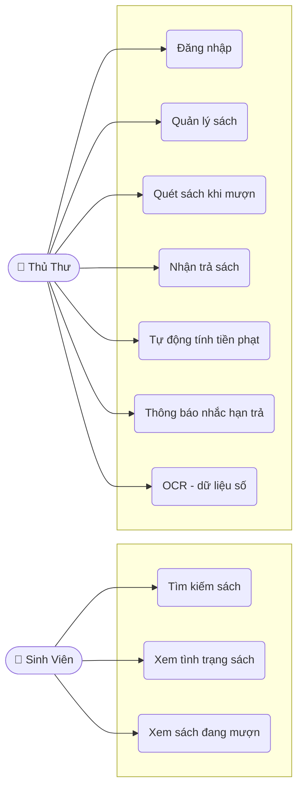
```mermaid
flowchart LR
    SV(["👤 Sinh Viên"])
    TT(["👤 Thủ Thư"])

    subgraph UC_SV ["  "]
        sv1(Tìm kiếm sách)
        sv2(Xem tình trạng sách)
        sv3(Xem sách đang mượn)
    end

    subgraph UC_TT ["  "]
        tt1(Đăng nhập)
        tt2(Quản lý sách)
        tt3(Quét sách khi mượn)
        tt4(Nhận trả sách)
        tt5(Tự động tính tiền phạt)
        tt6(Thông báo nhắc hạn trả)
        tt7(OCR - dữ liệu số)
    end

    SV --> sv1
    SV --> sv2
    SV --> sv3

    TT --> tt1
    TT --> tt2
    TT --> tt3
    TT --> tt4
    TT --> tt5
    TT --> tt6
    TT --> tt7
```

*Hình 2.1. Biểu đồ use case tổng quát*

---

### 2.1.2. Biểu đồ use case phân rã – Sinh Viên

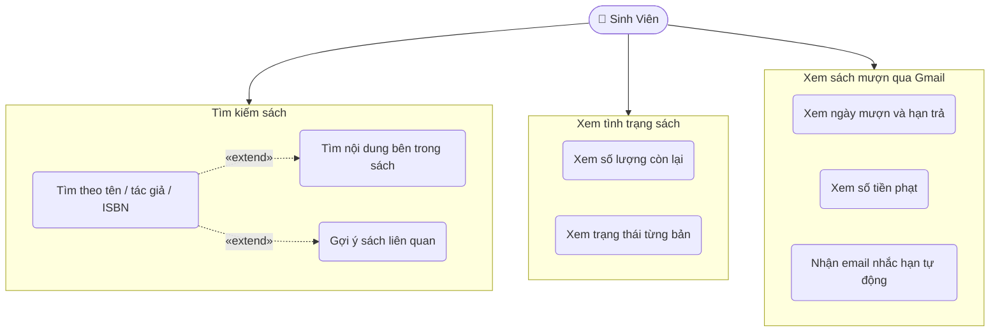
```mermaid
flowchart TB
    SV(["👤 Sinh Viên"])

    SV --> TK & TS & XM

    subgraph TK ["Tìm kiếm sách"]
        tk1(Tìm theo tên / tác giả / ISBN)
        tk2(Tìm nội dung bên trong sách)
        tk3(Gợi ý sách liên quan)
    end

    subgraph TS ["Xem tình trạng sách"]
        ts1(Xem số lượng còn lại)
        ts2(Xem trạng thái từng bản)
    end

    subgraph XM ["Xem sách mượn qua Gmail"]
        xm1(Xem ngày mượn và hạn trả)
        xm2(Xem số tiền phạt)
        xm3(Nhận email nhắc hạn tự động)
    end

    tk1 -.->|«extend»| tk2
    tk1 -.->|«extend»| tk3
```

*Hình 2.2. Biểu đồ use case phân rã – Sinh Viên*

---

### 2.1.3. Biểu đồ use case phân rã – Thủ Thư

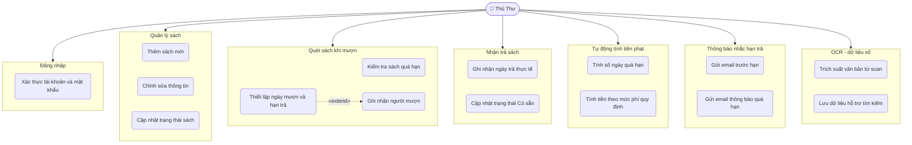
```mermaid
flowchart TB
    TT(["👤 Thủ Thư"])

    TT --> DN & QL & QS & NT & PH & TB_mail & OCR

    subgraph DN ["Đăng nhập"]
        dn1(Xác thực tài khoản và mật khẩu)
    end

    subgraph QL ["Quản lý sách"]
        ql1(Thêm sách mới)
        ql2(Chỉnh sửa thông tin)
        ql3(Cập nhật trạng thái sách)
    end

    subgraph QS ["Quét sách khi mượn"]
        qs1(Kiểm tra sách quá hạn)
        qs2(Thiết lập ngày mượn và hạn trả)
        qs3(Ghi nhận người mượn)
    end

    subgraph NT ["Nhận trả sách"]
        nt1(Ghi nhận ngày trả thực tế)
        nt2(Cập nhật trạng thái Có sẵn)
    end

    subgraph PH ["Tự động tính tiền phạt"]
        ph1(Tính số ngày quá hạn)
        ph2(Tính tiền theo mức phí quy định)
    end

    subgraph TB_mail ["Thông báo nhắc hạn trả"]
        tb1(Gửi email trước hạn)
        tb2(Gửi email thông báo quá hạn)
    end

    subgraph OCR ["OCR - dữ liệu số"]
        ocr1(Trích xuất văn bản từ scan)
        ocr2(Lưu dữ liệu hỗ trợ tìm kiếm)
    end

    qs2 -.->|«extend»| qs3
```

*Hình 2.3. Biểu đồ use case phân rã – Thủ Thư*

---

## 2.2. Mô tả chi tiết các use case

### 2.2.1. Đăng nhập

| Trường | Nội dung |
|---|---|
| **Tên use case** | Đăng nhập |
| **Tác nhân** | Thủ thư |
| **Mô tả vắn tắt** | Use case cho phép Thủ thư đăng nhập vào hệ thống bằng tài khoản đã được cấp. Sau khi đăng nhập thành công, hệ thống xác thực vai trò và chuyển hướng đến giao diện quản trị. |
| **Luồng các sự kiện** | **1. Luồng cơ bản**    1.1. Use case bắt đầu khi Thủ thư truy cập trang Đăng nhập.   1.2. Hệ thống hiển thị form gồm: username/email và password.   1.3. Thủ thư nhập thông tin và nhấn **Đăng nhập**.   1.4. Hệ thống kiểm tra dữ liệu đầu vào không được để trống.   1.5. Hệ thống truy vấn bảng `librarians` để xác thực username/email và password_hash.   1.6. Nếu hợp lệ: tạo session, lấy thông tin `id`, `full_name`, `email`.   1.7. Hệ thống chuyển hướng đến trang quản lý thư viện.   1.8. Use case kết thúc.    **2. Các luồng rẽ nhánh**    2.1. Bỏ trống thông tin → hiển thị "Vui lòng nhập đầy đủ thông tin đăng nhập."   2.2. Sai tài khoản hoặc mật khẩu → hiển thị "Tên đăng nhập hoặc mật khẩu không đúng."   2.3. Tài khoản bị khóa → hiển thị "Tài khoản đã bị khóa. Vui lòng liên hệ quản trị viên."   2.4. Lỗi hệ thống → hiển thị "Đăng nhập thất bại. Vui lòng thử lại sau." |
| **Các yêu cầu đặc biệt** | Mật khẩu được mã hóa khi lưu trữ. Quản lý phiên đăng nhập an toàn. |
| **Tiền điều kiện** | Người dùng đã có tài khoản hợp lệ. Hệ thống hoạt động bình thường. |
| **Hậu điều kiện** | Người dùng được cấp quyền truy cập tương ứng. Phiên đăng nhập được tạo trong hệ thống. |
| **Điểm mở rộng** | Không có |

---

### 2.2.2. Quét sách khi mượn

| Trường | Nội dung |
|---|---|
| **Tên use case** | Quét sách khi mượn |
| **Tác nhân** | Thủ thư |
| **Mô tả vắn tắt** | Use case cho phép Thủ thư quét mã vạch của sách và mã thẻ Độc giả để ghi nhận giao dịch mượn. Hệ thống kiểm tra tính hợp lệ trước khi xác nhận cho mượn, sau đó cập nhật trạng thái sách và lưu thông tin người mượn, ngày mượn, hạn trả. |
| **Luồng các sự kiện** | **1. Luồng cơ bản**    1.1. Use case bắt đầu khi Thủ thư chọn chức năng "Mượn sách".   1.2. Hệ thống hiển thị giao diện quét mã Độc giả.   1.3. Thủ thư quét mã thẻ Độc giả.   1.4. Hệ thống kiểm tra trạng thái tài khoản (còn hiệu lực, không bị khóa, không nợ phạt quá hạn).   1.5. Hệ thống hiển thị thông tin Độc giả (Họ tên, Mã thẻ, Số sách đang mượn).   1.6. Thủ thư quét mã vạch sách cần mượn.   1.7. Hệ thống kiểm tra tình trạng sách (còn trong kho, chưa có người mượn).   1.8. Thủ thư xác nhận thao tác mượn.   1.9. Hệ thống ghi nhận giao dịch vào cơ sở dữ liệu (Mã độc giả, Mã sách, Ngày mượn, Hạn trả).   1.10. Hệ thống cập nhật trạng thái sách thành "Đang được mượn".   1.11. Hiển thị "Mượn sách thành công." Use case kết thúc.    **2. Các luồng rẽ nhánh**    2.1. Độc giả có sách quá hạn → "Độc giả đang có sách quá hạn. Vui lòng xử lý trước khi mượn thêm."   2.2. Đạt giới hạn số sách mượn → "Độc giả đã đạt số lượng sách mượn tối đa."   2.3. Mã Độc giả không tồn tại → "Không tìm thấy thông tin Độc giả."   2.4. Sách đã có người mượn → "Sách hiện không khả dụng để mượn."   2.5. Mã sách không tồn tại → "Không tìm thấy thông tin sách."   2.6. Thủ thư nhấn "Hủy" → hủy thao tác, không lưu dữ liệu. |
| **Các yêu cầu đặc biệt** | Thời gian xử lý mỗi lần quét < 2 giây. Đảm bảo tính toàn vẹn dữ liệu. Lưu log giao dịch để tra cứu lịch sử. |
| **Tiền điều kiện** | Thủ thư đã đăng nhập. Độc giả có tài khoản hợp lệ. Sách tồn tại trong cơ sở dữ liệu. Kết nối mạng hoạt động bình thường. |
| **Hậu điều kiện** | Giao dịch mượn được lưu thành công. Trạng thái sách chuyển thành "Đang được mượn". Lịch sử mượn của Độc giả được cập nhật. |
| **Điểm mở rộng** | In phiếu mượn sách. Gửi email nhắc trả sách trước hạn. Tích hợp xác thực bằng mã QR. |

---

### 2.2.3. Tìm kiếm sách

| Trường | Nội dung |
|---|---|
| **Tên use case** | Tìm kiếm sách |
| **Tác nhân** | Sinh viên |
| **Mô tả vắn tắt** | Use case cho phép Sinh viên tìm kiếm sách thông qua từ khóa hoặc bộ lọc (tên sách, tác giả, ISBN, thể loại). Hệ thống truy vấn cơ sở dữ liệu và hiển thị kết quả phù hợp. Hỗ trợ mở rộng tìm kiếm nội dung bên trong sách và gợi ý sách liên quan. |
| **Luồng các sự kiện** | **1. Luồng cơ bản**    1.1. Use case bắt đầu khi Sinh viên truy cập trang "Tìm kiếm sách".   1.2. Hệ thống hiển thị thanh tìm kiếm và các bộ lọc (Tên sách, Tác giả, ISBN, Thể loại).   1.3. Sinh viên nhập từ khóa hoặc chọn bộ lọc rồi nhấn "Tìm kiếm".   1.4. Hệ thống kiểm tra dữ liệu đầu vào.   1.5. Hệ thống truy vấn cơ sở dữ liệu và hiển thị danh sách: Tên sách, Tác giả, Năm xuất bản, Thể loại, Tình trạng.   1.6. Sinh viên có thể chọn một sách để xem chi tiết.   1.7. Use case kết thúc khi kết quả tìm kiếm được hiển thị thành công.    **2. Các luồng rẽ nhánh**    2.1. Không nhập từ khóa → "Vui lòng nhập thông tin tìm kiếm."   2.2. Không tìm thấy kết quả → "Không tìm thấy sách phù hợp với từ khóa."   2.3. Lỗi hệ thống → "Hệ thống đang gặp sự cố. Vui lòng thử lại sau."   2.4. Sai định dạng ISBN → "ISBN không hợp lệ." |
| **Các yêu cầu đặc biệt** | Hỗ trợ tìm kiếm gần đúng (LIKE, full-text search). Phân trang kết quả. Thời gian phản hồi < 3 giây. |
| **Tiền điều kiện** | Hệ thống hoạt động bình thường. Cơ sở dữ liệu đã có dữ liệu sách. Không bắt buộc đăng nhập. |
| **Hậu điều kiện** | Danh sách kết quả hiển thị chính xác. Sinh viên có thể xem chi tiết hoặc thực hiện thao tác tiếp theo. |
| **Điểm mở rộng** | Gợi ý từ khóa (Auto-suggestion). Tìm kiếm nội dung bên trong sách. Gợi ý sách liên quan theo chủ đề. |

---

### 2.2.4. Xem tình trạng sách

| Trường | Nội dung |
|---|---|
| **Tên use case** | Xem tình trạng sách |
| **Tác nhân** | Sinh viên |
| **Mô tả vắn tắt** | Use case cho phép Sinh viên xem tình trạng chi tiết của một cuốn sách, bao gồm số lượng còn lại và trạng thái từng bản (Có sẵn/Đang mượn). |
| **Luồng các sự kiện** | **1. Luồng cơ bản**    1.1. Use case bắt đầu khi Sinh viên chọn một cuốn sách từ danh sách tìm kiếm.   1.2. Hệ thống truy vấn thông tin sách trong cơ sở dữ liệu.   1.3. Hệ thống hiển thị: Tên sách, Tác giả, ISBN, Thể loại, Mô tả, Số lượng còn lại, Trạng thái (Có sẵn/Đang mượn).   1.4. Sinh viên có thể chọn "Mượn sách" nếu sách còn.   1.5. Use case kết thúc khi thông tin chi tiết được hiển thị đầy đủ.    **2. Các luồng rẽ nhánh**    2.1. Sách không tồn tại → "Không tìm thấy thông tin sách."   2.2. Lỗi hệ thống → "Không thể hiển thị thông tin sách. Vui lòng thử lại sau." |
| **Các yêu cầu đặc biệt** | Thông tin hiển thị chính xác và cập nhật theo thời gian thực. |
| **Tiền điều kiện** | Sinh viên đã truy cập hệ thống. Sách tồn tại trong cơ sở dữ liệu. |
| **Hậu điều kiện** | Thông tin chi tiết của sách được hiển thị đầy đủ. |
| **Điểm mở rộng** | Hiển thị sách liên quan hoặc gợi ý tương tự. |

---

### 2.2.5. Xem sách đang mượn

| Trường | Nội dung |
|---|---|
| **Tên use case** | Xem sách đang mượn |
| **Tác nhân** | Sinh viên |
| **Mô tả vắn tắt** | Use case cho phép Sinh viên theo dõi danh sách sách đang mượn qua Gmail đã cung cấp khi giao dịch, bao gồm: Tên sách, Ngày mượn, Hạn trả, Trạng thái (còn hạn/quá hạn) và Số tiền phạt (nếu có). Hệ thống tự động gửi email nhắc hạn trước ngày trả. |
| **Luồng các sự kiện** | **1. Luồng cơ bản**    1.1. Sau khi mượn sách thành công, hệ thống gửi email xác nhận đến Gmail của Sinh viên.   1.2. Email chứa: Tên sách, Ngày mượn, Hạn trả, Trạng thái.   1.3. Hệ thống tự động tính tiền phạt nếu quá hạn và cập nhật trong email.   1.4. Trước hạn trả (1–3 ngày), hệ thống tự động gửi email nhắc hạn.   1.5. Use case kết thúc.    **2. Các luồng rẽ nhánh**    2.1. Không có sách đang mượn → không gửi email nhắc.   2.2. Sách quá hạn → email hiển thị trạng thái "Quá hạn" và số tiền phạt tương ứng.   2.3. Lỗi gửi email → ghi log lỗi, thử lại lần chạy tiếp theo. |
| **Các yêu cầu đặc biệt** | Số tiền phạt tính tự động và chính xác. Thông tin cập nhật theo thời gian thực. |
| **Tiền điều kiện** | Sinh viên đã cung cấp Gmail khi mượn sách. Hệ thống có dữ liệu giao dịch mượn của Sinh viên. |
| **Hậu điều kiện** | Sinh viên nắm được tình trạng mượn sách và số tiền phạt (nếu có). |
| **Điểm mở rộng** | Gửi email tự động qua Gmail khi sắp đến hạn (trước 1–3 ngày). Cho phép yêu cầu gia hạn trực tiếp. |

---

### 2.2.6. Nhận trả sách

| Trường | Nội dung |
|---|---|
| **Tên use case** | Nhận trả sách |
| **Tác nhân** | Thủ thư |
| **Mô tả vắn tắt** | Use case cho phép Thủ thư ghi nhận việc trả sách của Độc giả. Hệ thống kiểm tra thông tin giao dịch, tính tiền phạt nếu quá hạn và cập nhật trạng thái sách về "Có sẵn". |
| **Luồng các sự kiện** | **1. Luồng cơ bản**    1.1. Use case bắt đầu khi Thủ thư chọn chức năng "Trả sách".   1.2. Hệ thống hiển thị giao diện quét mã sách.   1.3. Thủ thư quét mã sách cần trả.   1.4. Hệ thống truy xuất và hiển thị: Tên sách, Tên Độc giả, Ngày mượn, Hạn trả, Số ngày quá hạn, Tiền phạt (nếu có).   1.5. Thủ thư xác nhận đã nhận lại sách.   1.6. Hệ thống cập nhật: ngày trả thực tế, trạng thái sách "Có sẵn", giao dịch "Đã hoàn tất".   1.7. Hiển thị "Trả sách thành công." Use case kết thúc.    **2. Các luồng rẽ nhánh**    2.1. Sách quá hạn → hiển thị tiền phạt, yêu cầu xác nhận thanh toán trước khi hoàn tất.   2.2. Mã sách không tồn tại → "Không tìm thấy thông tin sách."   2.3. Sách chưa từng được mượn → "Sách hiện không có giao dịch mượn."   2.4. Nhấn "Hủy" → hủy thao tác, không cập nhật dữ liệu.   2.5. Lỗi cơ sở dữ liệu → "Không thể xử lý yêu cầu, vui lòng thử lại." |
| **Các yêu cầu đặc biệt** | Tính tiền phạt tự động và chính xác. Thời gian xử lý < 2 giây. Lưu lịch sử giao dịch để tra cứu. |
| **Tiền điều kiện** | Thủ thư đã đăng nhập. Sách đang ở trạng thái "Đang được mượn". Cơ sở dữ liệu hoạt động bình thường. |
| **Hậu điều kiện** | Sách cập nhật về "Có sẵn". Giao dịch đánh dấu "Đã hoàn tất". Tiền phạt (nếu có) được ghi nhận. |
| **Điểm mở rộng** | Thanh toán tiền phạt trực tuyến. Gửi email xác nhận trả sách. Thống kê lượt trả theo ngày/tháng. |

---

### 2.2.7. Tự động tính tiền phạt

| Trường | Nội dung |
|---|---|
| **Tên use case** | Tự động tính tiền phạt |
| **Tác nhân** | Hệ thống (kích hoạt khi nhận trả sách hoặc Sinh viên xem sách đang mượn) |
| **Mô tả vắn tắt** | Hệ thống tự động tính tiền phạt khi sách trả quá hạn dựa trên số ngày quá hạn và mức phí đã cấu hình. Kết quả hiển thị cho Thủ thư và được lưu vào cơ sở dữ liệu. |
| **Luồng các sự kiện** | **1. Luồng cơ bản**    1.1. Use case được kích hoạt khi phát sinh sự kiện kiểm tra hạn trả.   1.2. Hệ thống lấy thông tin: Ngày mượn, Hạn trả, Ngày trả thực tế (hoặc ngày hiện tại nếu chưa trả).   1.3. Hệ thống so sánh ngày trả thực tế với hạn trả.   1.4. Nếu quá hạn: tính số ngày quá hạn.   1.5. Áp dụng công thức: **Tiền phạt = Số ngày quá hạn × Mức phí/ngày**.   1.6. Hệ thống hiển thị: Số ngày quá hạn, Mức phí/ngày, Tổng tiền phạt.   1.7. Hệ thống lưu thông tin tiền phạt vào cơ sở dữ liệu.   1.8. Use case kết thúc.    **2. Các luồng rẽ nhánh**    2.1. Trả đúng hạn hoặc trước hạn → hiển thị "Không phát sinh tiền phạt."   2.2. Mức phí khác nhau theo loại sách → áp dụng mức phí tương ứng với loại sách đó.   2.3. Lỗi truy xuất dữ liệu → "Không thể tính tiền phạt, vui lòng thử lại." |
| **Các yêu cầu đặc biệt** | Tính toán tuyệt đối chính xác. Thời gian xử lý < 1 giây. Mức phí có thể cấu hình trong hệ thống. Không tính trùng tiền phạt cho cùng một giao dịch. |
| **Tiền điều kiện** | Tồn tại giao dịch mượn hợp lệ. Có thông tin hạn trả rõ ràng. Mức phí phạt/ngày đã được thiết lập. |
| **Hậu điều kiện** | Tiền phạt được tính chính xác và lưu vào cơ sở dữ liệu. Dữ liệu phục vụ báo cáo thống kê. |
| **Điểm mở rộng** | Cấu hình nhiều mức phạt theo loại sách hoặc đối tượng Độc giả. Tích hợp thanh toán trực tuyến. |

---

### 2.2.8. Tự động thông báo nhắc hạn trả sách

| Trường | Nội dung |
|---|---|
| **Tên use case** | Tự động thông báo nhắc hạn trả sách |
| **Tác nhân** | Hệ thống (chạy tự động theo lịch) |
| **Mô tả vắn tắt** | Hệ thống tự động gửi email nhắc nhở Sinh viên khi sắp đến hạn hoặc đã quá hạn trả sách, giúp giảm tình trạng trả sách muộn và hạn chế phát sinh tiền phạt. |
| **Luồng các sự kiện** | **1. Luồng cơ bản**    1.1. Use case được kích hoạt tự động theo lịch (mỗi ngày lúc 00:00).   1.2. Hệ thống truy xuất danh sách các giao dịch mượn chưa hoàn tất.   1.3. Hệ thống kiểm tra: sách sắp đến hạn (còn 1–3 ngày) và sách đã quá hạn.   1.4. Hệ thống tạo nội dung email: Tên sách, Ngày mượn, Hạn trả, Số ngày còn lại hoặc quá hạn.   1.5. Hệ thống gửi email đến Gmail của Sinh viên.   1.6. Hệ thống ghi nhận trạng thái đã gửi thông báo.   1.7. Use case kết thúc.    **2. Các luồng rẽ nhánh**    2.1. Không có sách sắp hạn/quá hạn → hệ thống không gửi thông báo.   2.2. Gửi email thất bại → ghi log lỗi, thử gửi lại vào lần chạy tiếp theo.   2.3. Sinh viên đã trả sách trước khi hệ thống gửi → không gửi thông báo nữa. |
| **Các yêu cầu đặc biệt** | Không gửi trùng thông báo trong cùng một ngày. Nội dung email rõ ràng và chính xác. Có thể cấu hình số ngày nhắc trước hạn. |
| **Tiền điều kiện** | Tồn tại giao dịch mượn chưa hoàn tất. Hệ thống có Gmail hợp lệ của Sinh viên. Máy chủ gửi email hoạt động bình thường. |
| **Hậu điều kiện** | Sinh viên nhận được thông báo nhắc trả sách. Hệ thống lưu lịch sử gửi thông báo. |
| **Điểm mở rộng** | Gửi thông báo qua nhiều kênh (Email, SMS). Cho phép Sinh viên yêu cầu gia hạn trực tiếp từ email. |

---

### 2.2.9. OCR – Dữ liệu số

| Trường | Nội dung |
|---|---|
| **Tên use case** | OCR – Dữ liệu số |
| **Tác nhân** | Thủ thư |
| **Mô tả vắn tắt** | Use case cho phép Thủ thư sử dụng công nghệ OCR để trích xuất dữ liệu từ hình ảnh hoặc tài liệu scan (ISBN, mã sách, thông tin sách). Dữ liệu sau khi nhận dạng được kiểm tra và lưu vào cơ sở dữ liệu, giảm nhập liệu thủ công và hỗ trợ tìm kiếm nội dung sách. |
| **Luồng các sự kiện** | **1. Luồng cơ bản**    1.1. Use case bắt đầu khi Thủ thư chọn chức năng "Quét tài liệu bằng OCR".   1.2. Thủ thư tải lên file hình ảnh hoặc tài liệu scan (PNG, JPG, PDF).   1.3. Hệ thống tiền xử lý ảnh (lọc nhiễu, tăng độ tương phản).   1.4. Hệ thống thực hiện nhận dạng ký tự bằng công nghệ OCR.   1.5. Hệ thống trích xuất dữ liệu: ISBN, mã sách, năm xuất bản.   1.6. Hệ thống hiển thị kết quả để Thủ thư kiểm tra và chỉnh sửa nếu cần.   1.7. Thủ thư xác nhận thông tin.   1.8. Hệ thống lưu dữ liệu vào cơ sở dữ liệu.   1.9. Hiển thị "Trích xuất và lưu dữ liệu thành công." Use case kết thúc.    **2. Các luồng rẽ nhánh**    2.1. Ảnh mờ hoặc chất lượng thấp → "Không thể nhận dạng. Vui lòng tải ảnh rõ nét hơn."   2.2. Không tìm thấy dữ liệu hợp lệ → "Không phát hiện dữ liệu phù hợp."   2.3. Thủ thư hủy → dừng xử lý, không lưu dữ liệu.   2.4. Sai định dạng file → "Định dạng file không được hỗ trợ." |
| **Các yêu cầu đặc biệt** | Hỗ trợ JPG, PNG, PDF. Độ chính xác nhận dạng ≥ 90% với ảnh rõ nét. Thời gian xử lý < 5 giây. |
| **Tiền điều kiện** | Thủ thư đã đăng nhập. File tải lên hợp lệ. Hệ thống OCR hoạt động bình thường. |
| **Hậu điều kiện** | Dữ liệu số được trích xuất và lưu thành công. Giảm sai sót do nhập liệu thủ công. |
| **Điểm mở rộng** | Tự động điền biểu mẫu thêm sách từ dữ liệu OCR. Kết nối API tra cứu thông tin sách theo ISBN. Hỗ trợ nhận dạng tiếng Việt có dấu. |

---

### 2.2.10. Quản lý sách

| Trường | Nội dung |
|---|---|
| **Tên use case** | Quản lý sách |
| **Tác nhân** | Thủ thư |
| **Mô tả vắn tắt** | Use case cho phép Thủ thư thêm mới, chỉnh sửa thông tin và cập nhật trạng thái sách (Có sẵn, Đang được mượn, Mất, Hư hỏng, Thanh lý), đảm bảo dữ liệu tồn kho chính xác và phản ánh đúng thực tế. |
| **Luồng các sự kiện** | **1. Luồng cơ bản**    1.1. Use case bắt đầu khi Thủ thư chọn chức năng "Quản lý sách".   1.2. Hệ thống hiển thị danh sách sách hiện có trong cơ sở dữ liệu.   1.3. Thủ thư tìm kiếm hoặc chọn sách cần thao tác.   1.4. Thủ thư chọn: Thêm mới / Chỉnh sửa / Cập nhật trạng thái.   1.5. Nhập hoặc chỉnh sửa thông tin (Tên sách, Tác giả, ISBN, Số lượng, Trạng thái).   1.6. Nhấn "Lưu".   1.7. Hệ thống kiểm tra tính hợp lệ và lưu vào cơ sở dữ liệu.   1.8. Hiển thị "Cập nhật thành công." Use case kết thúc.    **2. Các luồng rẽ nhánh**    2.1. Sách đang "Đang được mượn" → không cho chuyển "Có sẵn" nếu chưa thực hiện trả sách hợp lệ.   2.2. Chọn trạng thái "Thanh lý" → yêu cầu xác nhận lại trước khi cập nhật.   2.3. Không tìm thấy sách → "Không tìm thấy thông tin sách."   2.4. Nhấn "Hủy" → quay lại danh sách, không lưu thay đổi.   2.5. Lỗi hệ thống → "Không thể cập nhật, vui lòng thử lại." |
| **Các yêu cầu đặc biệt** | Thời gian cập nhật < 2 giây. Mọi thay đổi trạng thái phải lưu log. Chỉ tài khoản Admin mới được cập nhật trạng thái. Không cho phép thao tác trái logic nghiệp vụ. |
| **Tiền điều kiện** | Thủ thư đã đăng nhập. Sách tồn tại trong cơ sở dữ liệu (với thao tác chỉnh sửa/cập nhật). Cơ sở dữ liệu hoạt động bình thường. |
| **Hậu điều kiện** | Thông tin/trạng thái sách được cập nhật chính xác. Dữ liệu tồn kho đồng bộ với thực tế. Thay đổi được ghi vào lịch sử quản lý. |
| **Điểm mở rộng** | Cập nhật trạng thái hàng loạt (Bulk Update). Tích hợp tự động chuyển trạng thái khi mượn/trả. Xuất báo cáo thống kê theo trạng thái. |

---

## 2.3. Phân tích các use case

---

### 2.3.1. Phân tích use case Đăng nhập

#### 2.3.1.1. Biểu đồ trình tự

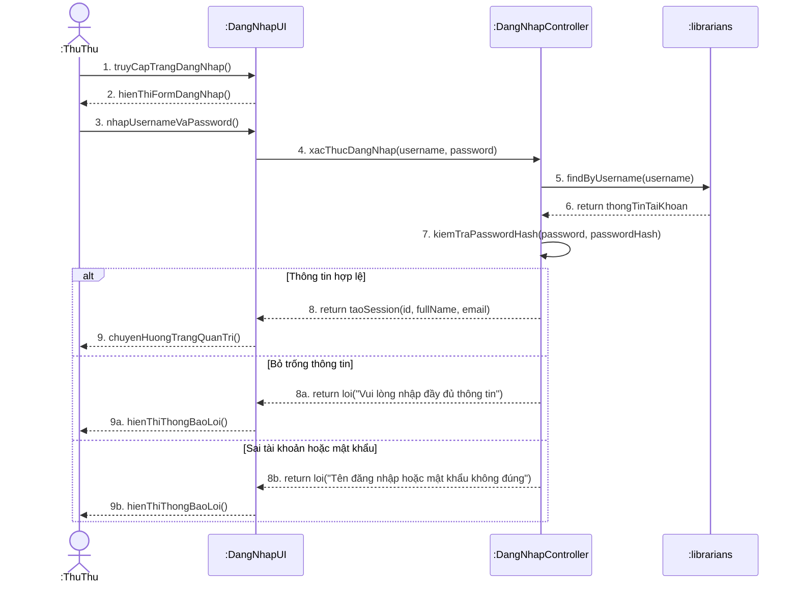
```mermaid
sequenceDiagram
    actor ThuThu as :ThuThu
    participant UI as :DangNhapUI
    participant CTRL as :DangNhapController
    participant DB as :librarians

    ThuThu->>UI: 1. truyCapTrangDangNhap()
    UI-->>ThuThu: 2. hienThiFormDangNhap()
    ThuThu->>UI: 3. nhapUsernameVaPassword()
    UI->>CTRL: 4. xacThucDangNhap(username, password)
    CTRL->>DB: 5. findByUsername(username)
    DB-->>CTRL: 6. return thongTinTaiKhoan
    CTRL->>CTRL: 7. kiemTraPasswordHash(password, passwordHash)
    alt Thông tin hợp lệ
        CTRL-->>UI: 8. return taoSession(id, fullName, email)
        UI-->>ThuThu: 9. chuyenHuongTrangQuanTri()
    else Bỏ trống thông tin
        CTRL-->>UI: 8a. return loi("Vui lòng nhập đầy đủ thông tin")
        UI-->>ThuThu: 9a. hienThiThongBaoLoi()
    else Sai tài khoản hoặc mật khẩu
        CTRL-->>UI: 8b. return loi("Tên đăng nhập hoặc mật khẩu không đúng")
        UI-->>ThuThu: 9b. hienThiThongBaoLoi()
    end
```

*Hình 2.4. Biểu đồ trình tự – Đăng nhập*

---

#### 2.3.1.2. Biểu đồ lớp phân tích

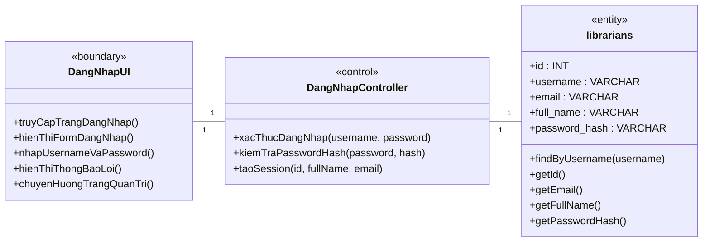
```mermaid
classDiagram
    direction LR
    class DangNhapUI {
        <<boundary>>
        +truyCapTrangDangNhap()
        +hienThiFormDangNhap()
        +nhapUsernameVaPassword()
        +hienThiThongBaoLoi()
        +chuyenHuongTrangQuanTri()
    }
    class DangNhapController {
        <<control>>
        +xacThucDangNhap(username, password)
        +kiemTraPasswordHash(password, hash)
        +taoSession(id, fullName, email)
    }
    class librarians {
        <<entity>>
        +id : INT
        +username : VARCHAR
        +email : VARCHAR
        +full_name : VARCHAR
        +password_hash : VARCHAR
        +findByUsername(username)
        +getId()
        +getEmail()
        +getFullName()
        +getPasswordHash()
    }
    DangNhapUI "1" -- "1" DangNhapController
    DangNhapController "1" -- "1" librarians
```

*Hình 2.5. Biểu đồ lớp phân tích – Đăng nhập*

---

### 2.3.2. Phân tích use case Quản lý sách

#### 2.3.2.1. Biểu đồ trình tự

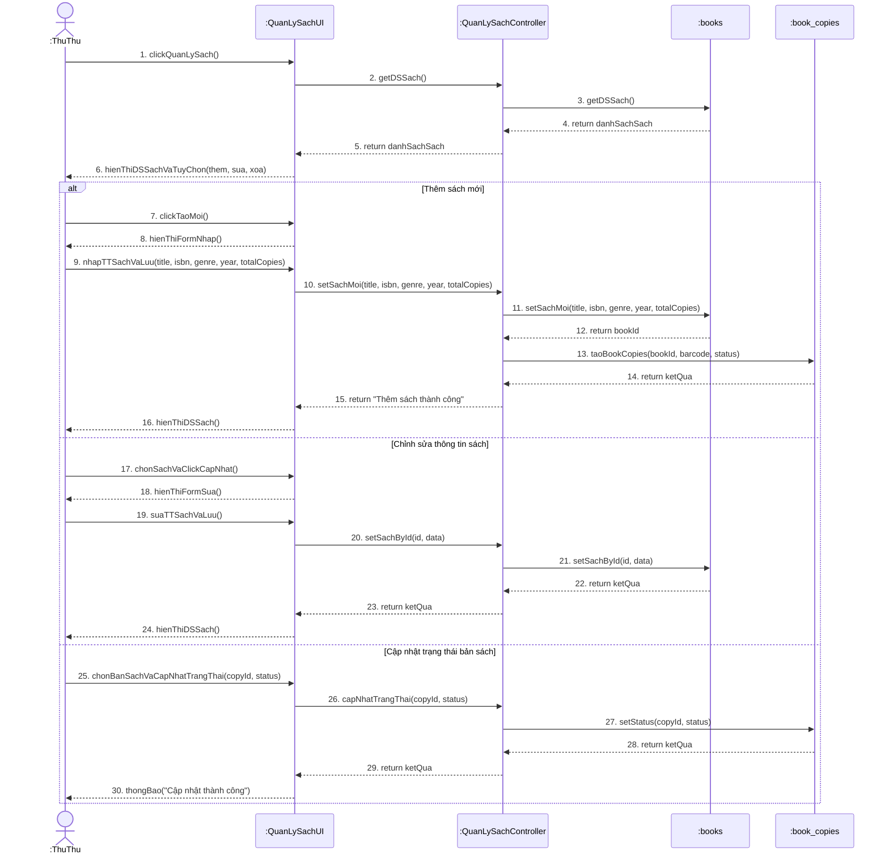
```mermaid
sequenceDiagram
    actor ThuThu as :ThuThu
    participant UI as :QuanLySachUI
    participant CTRL as :QuanLySachController
    participant B as :books
    participant BC as :book_copies

    ThuThu->>UI: 1. clickQuanLySach()
    UI->>CTRL: 2. getDSSach()
    CTRL->>B: 3. getDSSach()
    B-->>CTRL: 4. return danhSachSach
    CTRL-->>UI: 5. return danhSachSach
    UI-->>ThuThu: 6. hienThiDSSachVaTuyChon(them, sua, xoa)

    alt Thêm sách mới
        ThuThu->>UI: 7. clickTaoMoi()
        UI-->>ThuThu: 8. hienThiFormNhap()
        ThuThu->>UI: 9. nhapTTSachVaLuu(title, isbn, genre, year, totalCopies)
        UI->>CTRL: 10. setSachMoi(title, isbn, genre, year, totalCopies)
        CTRL->>B: 11. setSachMoi(title, isbn, genre, year, totalCopies)
        B-->>CTRL: 12. return bookId
        CTRL->>BC: 13. taoBookCopies(bookId, barcode, status)
        BC-->>CTRL: 14. return ketQua
        CTRL-->>UI: 15. return "Thêm sách thành công"
        UI-->>ThuThu: 16. hienThiDSSach()
    else Chỉnh sửa thông tin sách
        ThuThu->>UI: 17. chonSachVaClickCapNhat()
        UI-->>ThuThu: 18. hienThiFormSua()
        ThuThu->>UI: 19. suaTTSachVaLuu()
        UI->>CTRL: 20. setSachById(id, data)
        CTRL->>B: 21. setSachById(id, data)
        B-->>CTRL: 22. return ketQua
        CTRL-->>UI: 23. return ketQua
        UI-->>ThuThu: 24. hienThiDSSach()
    else Cập nhật trạng thái bản sách
        ThuThu->>UI: 25. chonBanSachVaCapNhatTrangThai(copyId, status)
        UI->>CTRL: 26. capNhatTrangThai(copyId, status)
        CTRL->>BC: 27. setStatus(copyId, status)
        BC-->>CTRL: 28. return ketQua
        CTRL-->>UI: 29. return ketQua
        UI-->>ThuThu: 30. thongBao("Cập nhật thành công")
    end
```

*Hình 2.6. Biểu đồ trình tự – Quản lý sách*

---

#### 2.3.2.2. Biểu đồ lớp phân tích

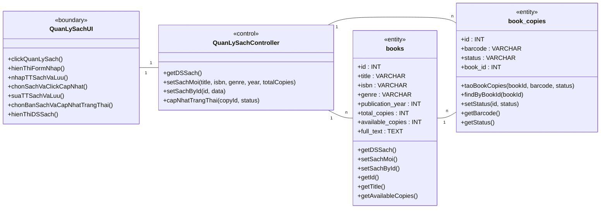
```mermaid
classDiagram
    direction LR
    class QuanLySachUI {
        <<boundary>>
        +clickQuanLySach()
        +hienThiFormNhap()
        +nhapTTSachVaLuu()
        +chonSachVaClickCapNhat()
        +suaTTSachVaLuu()
        +chonBanSachVaCapNhatTrangThai()
        +hienThiDSSach()
    }
    class QuanLySachController {
        <<control>>
        +getDSSach()
        +setSachMoi(title, isbn, genre, year, totalCopies)
        +setSachById(id, data)
        +capNhatTrangThai(copyId, status)
    }
    class books {
        <<entity>>
        +id : INT
        +title : VARCHAR
        +isbn : VARCHAR
        +genre : VARCHAR
        +publication_year : INT
        +total_copies : INT
        +available_copies : INT
        +full_text : TEXT
        +getDSSach()
        +setSachMoi()
        +setSachById()
        +getId()
        +getTitle()
        +getAvailableCopies()
    }
    class book_copies {
        <<entity>>
        +id : INT
        +barcode : VARCHAR
        +status : VARCHAR
        +book_id : INT
        +taoBookCopies(bookId, barcode, status)
        +findByBookId(bookId)
        +setStatus(id, status)
        +getBarcode()
        +getStatus()
    }
    QuanLySachUI "1" -- "1" QuanLySachController
    QuanLySachController "1" -- "n" books
    QuanLySachController "1" -- "n" book_copies
    books "1" -- "n" book_copies
```

*Hình 2.7. Biểu đồ lớp phân tích – Quản lý sách*

---

### 2.3.3. Phân tích use case Quét sách khi mượn

#### 2.3.3.1. Biểu đồ trình tự

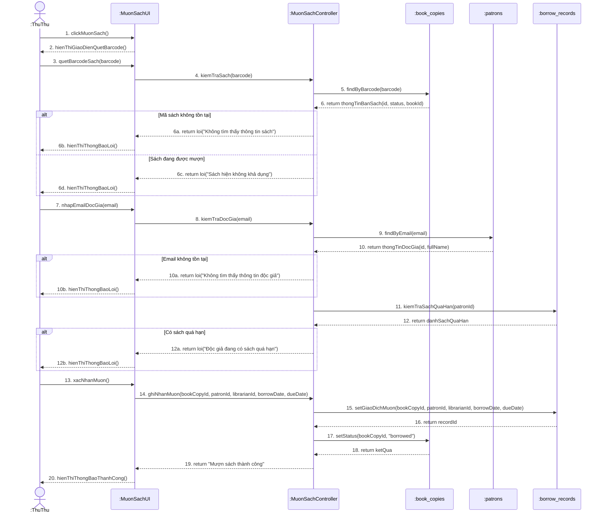
```mermaid
sequenceDiagram
    actor ThuThu as :ThuThu
    participant UI as :MuonSachUI
    participant CTRL as :MuonSachController
    participant BC as :book_copies
    participant P as :patrons
    participant BR as :borrow_records

    ThuThu->>UI: 1. clickMuonSach()
    UI-->>ThuThu: 2. hienThiGiaoDienQuetBarcode()
    ThuThu->>UI: 3. quetBarcodeSach(barcode)
    UI->>CTRL: 4. kiemTraSach(barcode)
    CTRL->>BC: 5. findByBarcode(barcode)
    BC-->>CTRL: 6. return thongTinBanSach(id, status, bookId)
    alt Mã sách không tồn tại
        CTRL-->>UI: 6a. return loi("Không tìm thấy thông tin sách")
        UI-->>ThuThu: 6b. hienThiThongBaoLoi()
    else Sách đang được mượn
        CTRL-->>UI: 6c. return loi("Sách hiện không khả dụng")
        UI-->>ThuThu: 6d. hienThiThongBaoLoi()
    end
    ThuThu->>UI: 7. nhapEmailDocGia(email)
    UI->>CTRL: 8. kiemTraDocGia(email)
    CTRL->>P: 9. findByEmail(email)
    P-->>CTRL: 10. return thongTinDocGia(id, fullName)
    alt Email không tồn tại
        CTRL-->>UI: 10a. return loi("Không tìm thấy thông tin độc giả")
        UI-->>ThuThu: 10b. hienThiThongBaoLoi()
    end
    CTRL->>BR: 11. kiemTraSachQuaHan(patronId)
    BR-->>CTRL: 12. return danhSachQuaHan
    alt Có sách quá hạn
        CTRL-->>UI: 12a. return loi("Độc giả đang có sách quá hạn")
        UI-->>ThuThu: 12b. hienThiThongBaoLoi()
    end
    ThuThu->>UI: 13. xacNhanMuon()
    UI->>CTRL: 14. ghiNhanMuon(bookCopyId, patronId, librarianId, borrowDate, dueDate)
    CTRL->>BR: 15. setGiaoDichMuon(bookCopyId, patronId, librarianId, borrowDate, dueDate)
    BR-->>CTRL: 16. return recordId
    CTRL->>BC: 17. setStatus(bookCopyId, "borrowed")
    BC-->>CTRL: 18. return ketQua
    CTRL-->>UI: 19. return "Mượn sách thành công"
    UI-->>ThuThu: 20. hienThiThongBaoThanhCong()
```

*Hình 2.8. Biểu đồ trình tự – Quét sách khi mượn*

---

#### 2.3.3.2. Biểu đồ lớp phân tích

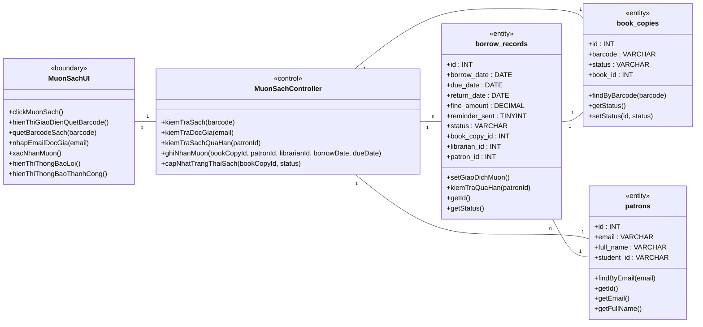
```mermaid
classDiagram
    direction LR
    class MuonSachUI {
        <<boundary>>
        +clickMuonSach()
        +hienThiGiaoDienQuetBarcode()
        +quetBarcodeSach(barcode)
        +nhapEmailDocGia(email)
        +xacNhanMuon()
        +hienThiThongBaoLoi()
        +hienThiThongBaoThanhCong()
    }
    class MuonSachController {
        <<control>>
        +kiemTraSach(barcode)
        +kiemTraDocGia(email)
        +kiemTraSachQuaHan(patronId)
        +ghiNhanMuon(bookCopyId, patronId, librarianId, borrowDate, dueDate)
        +capNhatTrangThaiSach(bookCopyId, status)
    }
    class book_copies {
        <<entity>>
        +id : INT
        +barcode : VARCHAR
        +status : VARCHAR
        +book_id : INT
        +findByBarcode(barcode)
        +getStatus()
        +setStatus(id, status)
    }
    class patrons {
        <<entity>>
        +id : INT
        +email : VARCHAR
        +full_name : VARCHAR
        +student_id : VARCHAR
        +findByEmail(email)
        +getId()
        +getEmail()
        +getFullName()
    }
    class borrow_records {
        <<entity>>
        +id : INT
        +borrow_date : DATE
        +due_date : DATE
        +return_date : DATE
        +fine_amount : DECIMAL
        +reminder_sent : TINYINT
        +status : VARCHAR
        +book_copy_id : INT
        +librarian_id : INT
        +patron_id : INT
        +setGiaoDichMuon()
        +kiemTraQuaHan(patronId)
        +getId()
        +getStatus()
    }
    MuonSachUI "1" -- "1" MuonSachController
    MuonSachController "1" -- "1" book_copies
    MuonSachController "1" -- "1" patrons
    MuonSachController "1" -- "n" borrow_records
    borrow_records "n" -- "1" patrons
    borrow_records "1" -- "1" book_copies
```

*Hình 2.9. Biểu đồ lớp phân tích – Quét sách khi mượn*

---

### 2.3.4. Phân tích use case Tìm kiếm sách

#### 2.3.4.1. Biểu đồ trình tự

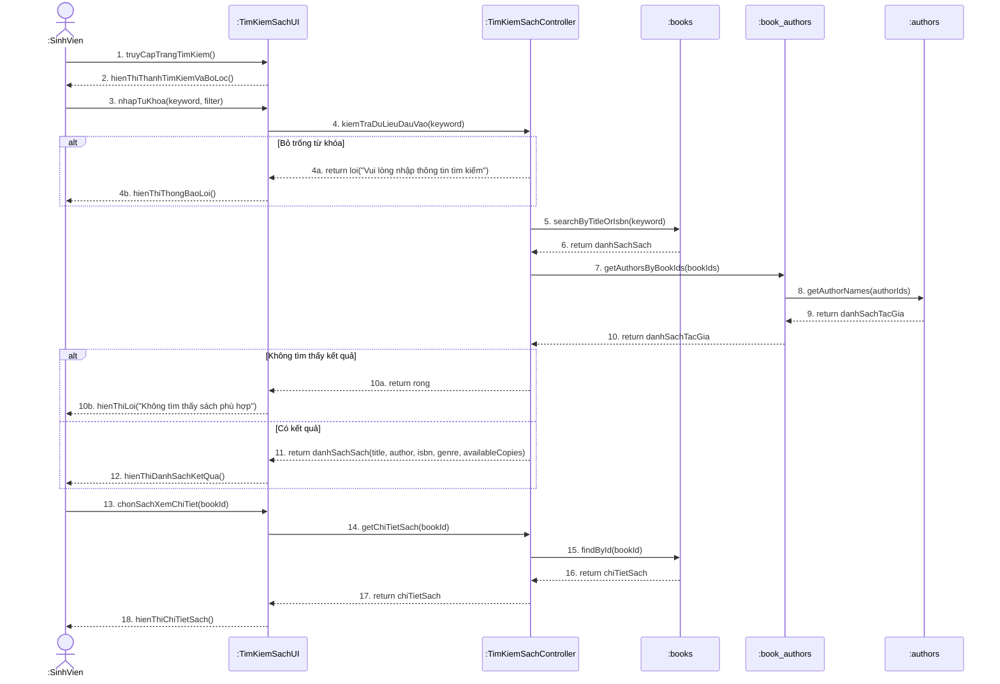
```mermaid
sequenceDiagram
    actor SinhVien as :SinhVien
    participant UI as :TimKiemSachUI
    participant CTRL as :TimKiemSachController
    participant B as :books
    participant BA as :book_authors
    participant A as :authors

    SinhVien->>UI: 1. truyCapTrangTimKiem()
    UI-->>SinhVien: 2. hienThiThanhTimKiemVaBoLoc()
    SinhVien->>UI: 3. nhapTuKhoa(keyword, filter)
    UI->>CTRL: 4. kiemTraDuLieuDauVao(keyword)
    alt Bỏ trống từ khóa
        CTRL-->>UI: 4a. return loi("Vui lòng nhập thông tin tìm kiếm")
        UI-->>SinhVien: 4b. hienThiThongBaoLoi()
    end
    CTRL->>B: 5. searchByTitleOrIsbn(keyword)
    B-->>CTRL: 6. return danhSachSach
    CTRL->>BA: 7. getAuthorsByBookIds(bookIds)
    BA->>A: 8. getAuthorNames(authorIds)
    A-->>BA: 9. return danhSachTacGia
    BA-->>CTRL: 10. return danhSachTacGia
    alt Không tìm thấy kết quả
        CTRL-->>UI: 10a. return rong
        UI-->>SinhVien: 10b. hienThiLoi("Không tìm thấy sách phù hợp")
    else Có kết quả
        CTRL-->>UI: 11. return danhSachSach(title, author, isbn, genre, availableCopies)
        UI-->>SinhVien: 12. hienThiDanhSachKetQua()
    end
    SinhVien->>UI: 13. chonSachXemChiTiet(bookId)
    UI->>CTRL: 14. getChiTietSach(bookId)
    CTRL->>B: 15. findById(bookId)
    B-->>CTRL: 16. return chiTietSach
    CTRL-->>UI: 17. return chiTietSach
    UI-->>SinhVien: 18. hienThiChiTietSach()
```

*Hình 2.10. Biểu đồ trình tự – Tìm kiếm sách*

---

#### 2.3.4.2. Biểu đồ lớp phân tích

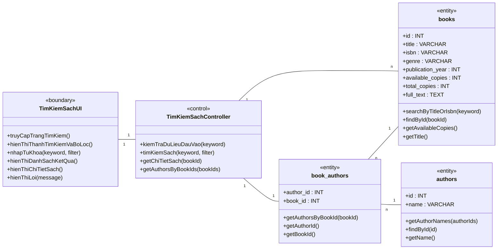
```mermaid
classDiagram
    direction LR
    class TimKiemSachUI {
        <<boundary>>
        +truyCapTrangTimKiem()
        +hienThiThanhTimKiemVaBoLoc()
        +nhapTuKhoa(keyword, filter)
        +hienThiDanhSachKetQua()
        +hienThiChiTietSach()
        +hienThiLoi(message)
    }
    class TimKiemSachController {
        <<control>>
        +kiemTraDuLieuDauVao(keyword)
        +timKiemSach(keyword, filter)
        +getChiTietSach(bookId)
        +getAuthorsByBookIds(bookIds)
    }
    class books {
        <<entity>>
        +id : INT
        +title : VARCHAR
        +isbn : VARCHAR
        +genre : VARCHAR
        +publication_year : INT
        +available_copies : INT
        +total_copies : INT
        +full_text : TEXT
        +searchByTitleOrIsbn(keyword)
        +findById(bookId)
        +getAvailableCopies()
        +getTitle()
    }
    class book_authors {
        <<entity>>
        +author_id : INT
        +book_id : INT
        +getAuthorsByBookId(bookId)
        +getAuthorId()
        +getBookId()
    }
    class authors {
        <<entity>>
        +id : INT
        +name : VARCHAR
        +getAuthorNames(authorIds)
        +findById(id)
        +getName()
    }
    TimKiemSachUI "1" -- "1" TimKiemSachController
    TimKiemSachController "1" -- "n" books
    TimKiemSachController "1" -- "1" book_authors
    book_authors "n" -- "1" authors
    book_authors "n" -- "1" books
```

*Hình 2.11. Biểu đồ lớp phân tích – Tìm kiếm sách*

---

### 2.3.5. Phân tích use case Xem tình trạng sách

#### 2.3.5.1. Biểu đồ trình tự

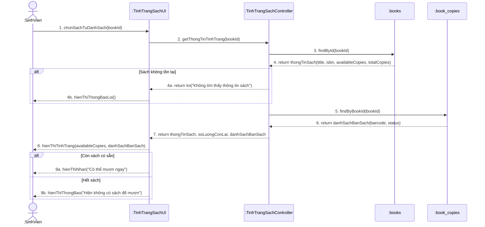
```mermaid
sequenceDiagram
    actor SinhVien as :SinhVien
    participant UI as :TinhTrangSachUI
    participant CTRL as :TinhTrangSachController
    participant B as :books
    participant BC as :book_copies

    SinhVien->>UI: 1. chonSachTuDanhSach(bookId)
    UI->>CTRL: 2. getThongTinTinhTrang(bookId)
    CTRL->>B: 3. findById(bookId)
    B-->>CTRL: 4. return thongTinSach(title, isbn, availableCopies, totalCopies)
    alt Sách không tồn tại
        CTRL-->>UI: 4a. return loi("Không tìm thấy thông tin sách")
        UI-->>SinhVien: 4b. hienThiThongBaoLoi()
    end
    CTRL->>BC: 5. findByBookId(bookId)
    BC-->>CTRL: 6. return danhSachBanSach(barcode, status)
    CTRL-->>UI: 7. return thongTinSach, soLuongConLai, danhSachBanSach
    UI-->>SinhVien: 8. hienThiTinhTrang(availableCopies, danhSachBanSach)
    alt Còn sách có sẵn
        UI-->>SinhVien: 9a. hienThiNhan("Có thể mượn ngay")
    else Hết sách
        UI-->>SinhVien: 9b. hienThiThongBao("Hiện không có sách để mượn")
    end
```

*Hình 2.12. Biểu đồ trình tự – Xem tình trạng sách*

---

#### 2.3.5.2. Biểu đồ lớp phân tích

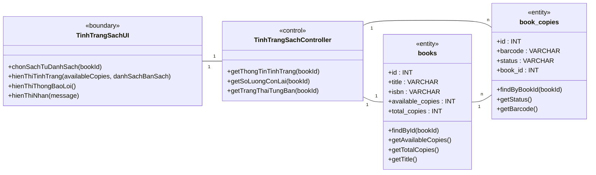
```mermaid
classDiagram
    direction LR
    class TinhTrangSachUI {
        <<boundary>>
        +chonSachTuDanhSach(bookId)
        +hienThiTinhTrang(availableCopies, danhSachBanSach)
        +hienThiThongBaoLoi()
        +hienThiNhan(message)
    }
    class TinhTrangSachController {
        <<control>>
        +getThongTinTinhTrang(bookId)
        +getSoLuongConLai(bookId)
        +getTrangThaiTungBan(bookId)
    }
    class books {
        <<entity>>
        +id : INT
        +title : VARCHAR
        +isbn : VARCHAR
        +available_copies : INT
        +total_copies : INT
        +findById(bookId)
        +getAvailableCopies()
        +getTotalCopies()
        +getTitle()
    }
    class book_copies {
        <<entity>>
        +id : INT
        +barcode : VARCHAR
        +status : VARCHAR
        +book_id : INT
        +findByBookId(bookId)
        +getStatus()
        +getBarcode()
    }
    TinhTrangSachUI "1" -- "1" TinhTrangSachController
    TinhTrangSachController "1" -- "1" books
    TinhTrangSachController "1" -- "n" book_copies
    books "1" -- "n" book_copies
```

*Hình 2.13. Biểu đồ lớp phân tích – Xem tình trạng sách*

---

### 2.3.6. Phân tích use case Xem sách đang mượn

#### 2.3.6.1. Biểu đồ trình tự

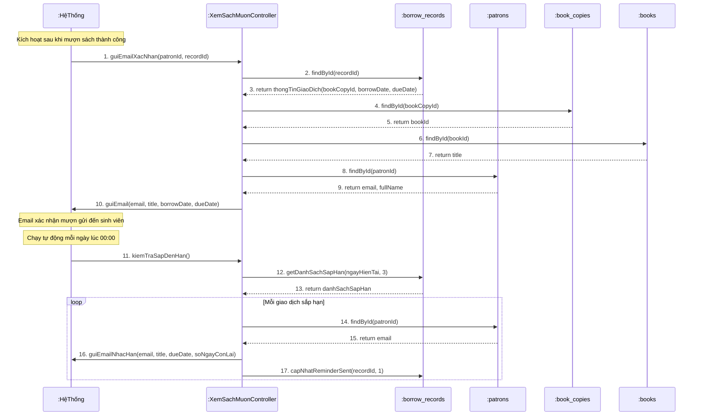
```mermaid
sequenceDiagram
    participant HT as :HệThống
    participant CTRL as :XemSachMuonController
    participant BR as :borrow_records
    participant P as :patrons
    participant BC as :book_copies
    participant B as :books

    Note over HT: Kích hoạt sau khi mượn sách thành công
    HT->>CTRL: 1. guiEmailXacNhan(patronId, recordId)
    CTRL->>BR: 2. findById(recordId)
    BR-->>CTRL: 3. return thongTinGiaoDich(bookCopyId, borrowDate, dueDate)
    CTRL->>BC: 4. findById(bookCopyId)
    BC-->>CTRL: 5. return bookId
    CTRL->>B: 6. findById(bookId)
    B-->>CTRL: 7. return title
    CTRL->>P: 8. findById(patronId)
    P-->>CTRL: 9. return email, fullName
    CTRL->>HT: 10. guiEmail(email, title, borrowDate, dueDate)
    Note over HT: Email xác nhận mượn gửi đến sinh viên

    Note over HT: Chạy tự động mỗi ngày lúc 00:00
    HT->>CTRL: 11. kiemTraSapDenHan()
    CTRL->>BR: 12. getDanhSachSapHan(ngayHienTai, 3)
    BR-->>CTRL: 13. return danhSachSapHan
    loop Mỗi giao dịch sắp hạn
        CTRL->>P: 14. findById(patronId)
        P-->>CTRL: 15. return email
        CTRL->>HT: 16. guiEmailNhacHan(email, title, dueDate, soNgayConLai)
        CTRL->>BR: 17. capNhatReminderSent(recordId, 1)
    end
```

*Hình 2.14. Biểu đồ trình tự – Xem sách đang mượn*

---

#### 2.3.6.2. Biểu đồ lớp phân tích

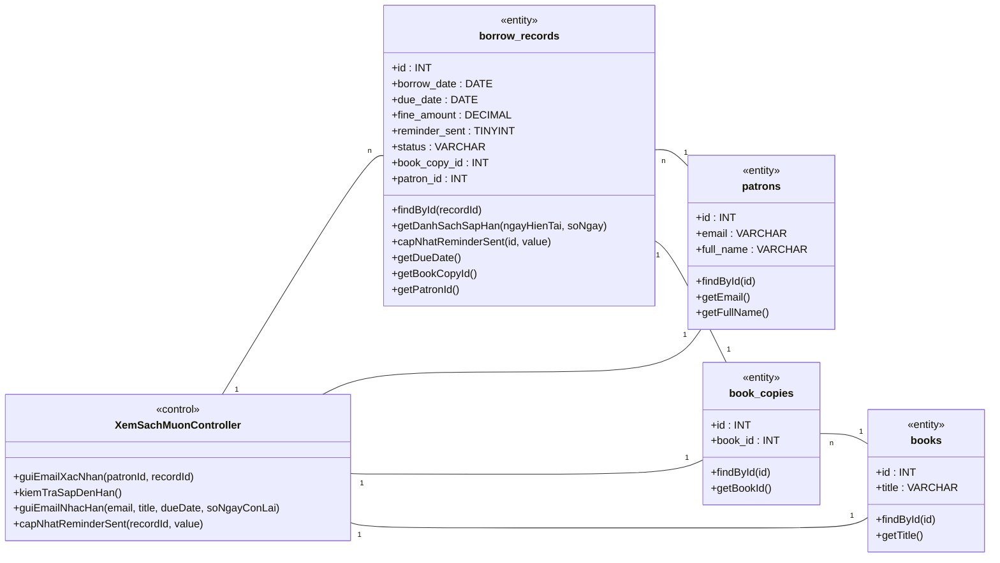
```mermaid
classDiagram
    direction LR
    class XemSachMuonController {
        <<control>>
        +guiEmailXacNhan(patronId, recordId)
        +kiemTraSapDenHan()
        +guiEmailNhacHan(email, title, dueDate, soNgayConLai)
        +capNhatReminderSent(recordId, value)
    }
    class borrow_records {
        <<entity>>
        +id : INT
        +borrow_date : DATE
        +due_date : DATE
        +fine_amount : DECIMAL
        +reminder_sent : TINYINT
        +status : VARCHAR
        +book_copy_id : INT
        +patron_id : INT
        +findById(recordId)
        +getDanhSachSapHan(ngayHienTai, soNgay)
        +capNhatReminderSent(id, value)
        +getDueDate()
        +getBookCopyId()
        +getPatronId()
    }
    class patrons {
        <<entity>>
        +id : INT
        +email : VARCHAR
        +full_name : VARCHAR
        +findById(id)
        +getEmail()
        +getFullName()
    }
    class book_copies {
        <<entity>>
        +id : INT
        +book_id : INT
        +findById(id)
        +getBookId()
    }
    class books {
        <<entity>>
        +id : INT
        +title : VARCHAR
        +findById(id)
        +getTitle()
    }
    XemSachMuonController "1" -- "n" borrow_records
    XemSachMuonController "1" -- "1" patrons
    XemSachMuonController "1" -- "1" book_copies
    XemSachMuonController "1" -- "1" books
    borrow_records "n" -- "1" patrons
    borrow_records "1" -- "1" book_copies
    book_copies "n" -- "1" books
```

*Hình 2.15. Biểu đồ lớp phân tích – Xem sách đang mượn*

---

### 2.3.7. Phân tích use case Nhận trả sách

#### 2.3.7.1. Biểu đồ trình tự

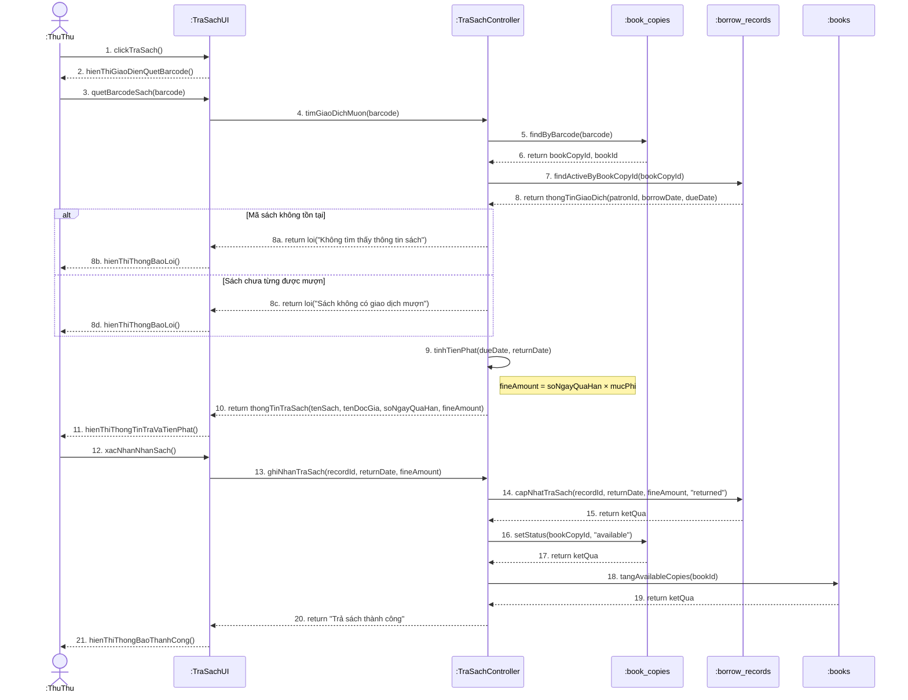
```mermaid
sequenceDiagram
    actor ThuThu as :ThuThu
    participant UI as :TraSachUI
    participant CTRL as :TraSachController
    participant BC as :book_copies
    participant BR as :borrow_records
    participant B as :books

    ThuThu->>UI: 1. clickTraSach()
    UI-->>ThuThu: 2. hienThiGiaoDienQuetBarcode()
    ThuThu->>UI: 3. quetBarcodeSach(barcode)
    UI->>CTRL: 4. timGiaoDichMuon(barcode)
    CTRL->>BC: 5. findByBarcode(barcode)
    BC-->>CTRL: 6. return bookCopyId, bookId
    CTRL->>BR: 7. findActiveByBookCopyId(bookCopyId)
    BR-->>CTRL: 8. return thongTinGiaoDich(patronId, borrowDate, dueDate)
    alt Mã sách không tồn tại
        CTRL-->>UI: 8a. return loi("Không tìm thấy thông tin sách")
        UI-->>ThuThu: 8b. hienThiThongBaoLoi()
    else Sách chưa từng được mượn
        CTRL-->>UI: 8c. return loi("Sách không có giao dịch mượn")
        UI-->>ThuThu: 8d. hienThiThongBaoLoi()
    end
    CTRL->>CTRL: 9. tinhTienPhat(dueDate, returnDate)
    Note right of CTRL: fineAmount = soNgayQuaHan × mucPhi
    CTRL-->>UI: 10. return thongTinTraSach(tenSach, tenDocGia, soNgayQuaHan, fineAmount)
    UI-->>ThuThu: 11. hienThiThongTinTraVaTienPhat()
    ThuThu->>UI: 12. xacNhanNhanSach()
    UI->>CTRL: 13. ghiNhanTraSach(recordId, returnDate, fineAmount)
    CTRL->>BR: 14. capNhatTraSach(recordId, returnDate, fineAmount, "returned")
    BR-->>CTRL: 15. return ketQua
    CTRL->>BC: 16. setStatus(bookCopyId, "available")
    BC-->>CTRL: 17. return ketQua
    CTRL->>B: 18. tangAvailableCopies(bookId)
    B-->>CTRL: 19. return ketQua
    CTRL-->>UI: 20. return "Trả sách thành công"
    UI-->>ThuThu: 21. hienThiThongBaoThanhCong()
```

*Hình 2.16. Biểu đồ trình tự – Nhận trả sách*

---

#### 2.3.7.2. Biểu đồ lớp phân tích

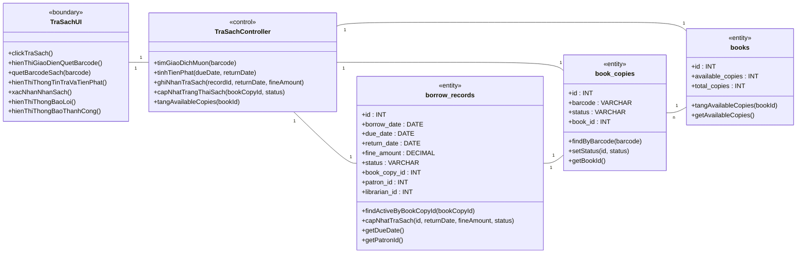
```mermaid
classDiagram
    direction LR
    class TraSachUI {
        <<boundary>>
        +clickTraSach()
        +hienThiGiaoDienQuetBarcode()
        +quetBarcodeSach(barcode)
        +hienThiThongTinTraVaTienPhat()
        +xacNhanNhanSach()
        +hienThiThongBaoLoi()
        +hienThiThongBaoThanhCong()
    }
    class TraSachController {
        <<control>>
        +timGiaoDichMuon(barcode)
        +tinhTienPhat(dueDate, returnDate)
        +ghiNhanTraSach(recordId, returnDate, fineAmount)
        +capNhatTrangThaiSach(bookCopyId, status)
        +tangAvailableCopies(bookId)
    }
    class book_copies {
        <<entity>>
        +id : INT
        +barcode : VARCHAR
        +status : VARCHAR
        +book_id : INT
        +findByBarcode(barcode)
        +setStatus(id, status)
        +getBookId()
    }
    class borrow_records {
        <<entity>>
        +id : INT
        +borrow_date : DATE
        +due_date : DATE
        +return_date : DATE
        +fine_amount : DECIMAL
        +status : VARCHAR
        +book_copy_id : INT
        +patron_id : INT
        +librarian_id : INT
        +findActiveByBookCopyId(bookCopyId)
        +capNhatTraSach(id, returnDate, fineAmount, status)
        +getDueDate()
        +getPatronId()
    }
    class books {
        <<entity>>
        +id : INT
        +available_copies : INT
        +total_copies : INT
        +tangAvailableCopies(bookId)
        +getAvailableCopies()
    }
    TraSachUI "1" -- "1" TraSachController
    TraSachController "1" -- "1" book_copies
    TraSachController "1" -- "1" borrow_records
    TraSachController "1" -- "1" books
    borrow_records "1" -- "1" book_copies
    book_copies "n" -- "1" books
```

*Hình 2.17. Biểu đồ lớp phân tích – Nhận trả sách*

---

### 2.3.8. Phân tích use case Tự động tính tiền phạt

#### 2.3.8.1. Biểu đồ trình tự

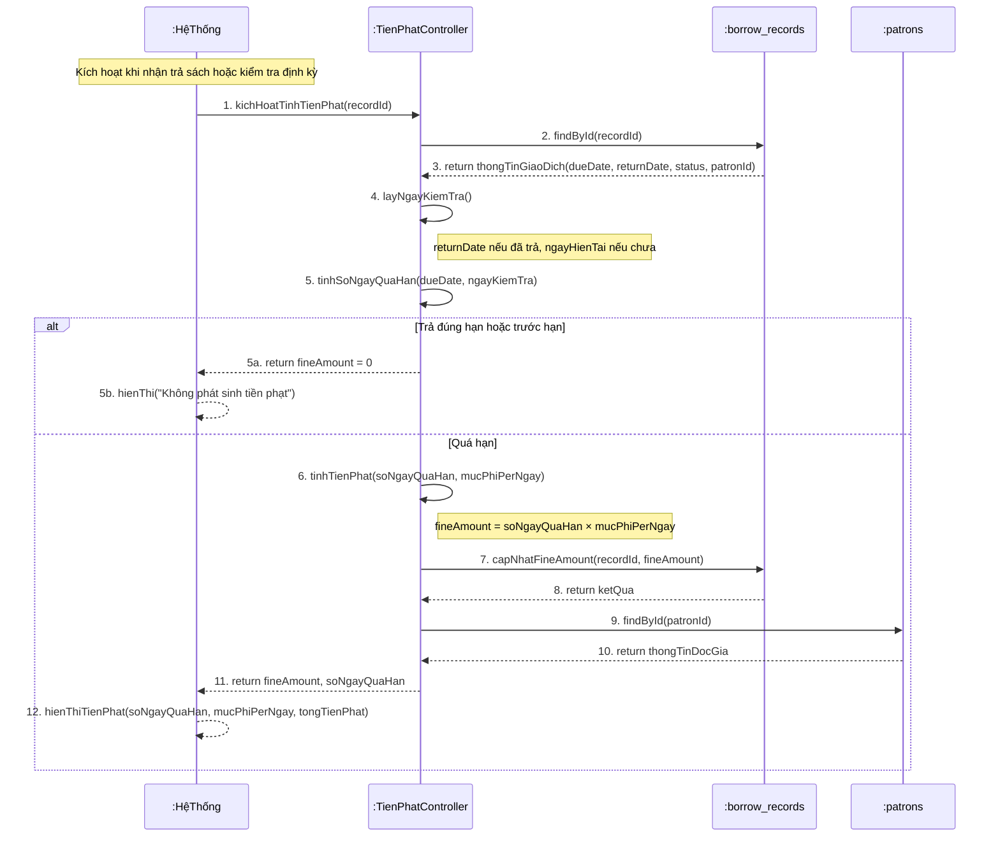
```mermaid
sequenceDiagram
    participant HT as :HệThống
    participant CTRL as :TienPhatController
    participant BR as :borrow_records
    participant P as :patrons

    Note over HT: Kích hoạt khi nhận trả sách hoặc kiểm tra định kỳ
    HT->>CTRL: 1. kichHoatTinhTienPhat(recordId)
    CTRL->>BR: 2. findById(recordId)
    BR-->>CTRL: 3. return thongTinGiaoDich(dueDate, returnDate, status, patronId)
    CTRL->>CTRL: 4. layNgayKiemTra()
    Note right of CTRL: returnDate nếu đã trả, ngayHienTai nếu chưa
    CTRL->>CTRL: 5. tinhSoNgayQuaHan(dueDate, ngayKiemTra)
    alt Trả đúng hạn hoặc trước hạn
        CTRL-->>HT: 5a. return fineAmount = 0
        HT-->>HT: 5b. hienThi("Không phát sinh tiền phạt")
    else Quá hạn
        CTRL->>CTRL: 6. tinhTienPhat(soNgayQuaHan, mucPhiPerNgay)
        Note right of CTRL: fineAmount = soNgayQuaHan × mucPhiPerNgay
        CTRL->>BR: 7. capNhatFineAmount(recordId, fineAmount)
        BR-->>CTRL: 8. return ketQua
        CTRL->>P: 9. findById(patronId)
        P-->>CTRL: 10. return thongTinDocGia
        CTRL-->>HT: 11. return fineAmount, soNgayQuaHan
        HT-->>HT: 12. hienThiTienPhat(soNgayQuaHan, mucPhiPerNgay, tongTienPhat)
    end
```

*Hình 2.18. Biểu đồ trình tự – Tự động tính tiền phạt*

---

#### 2.3.8.2. Biểu đồ lớp phân tích

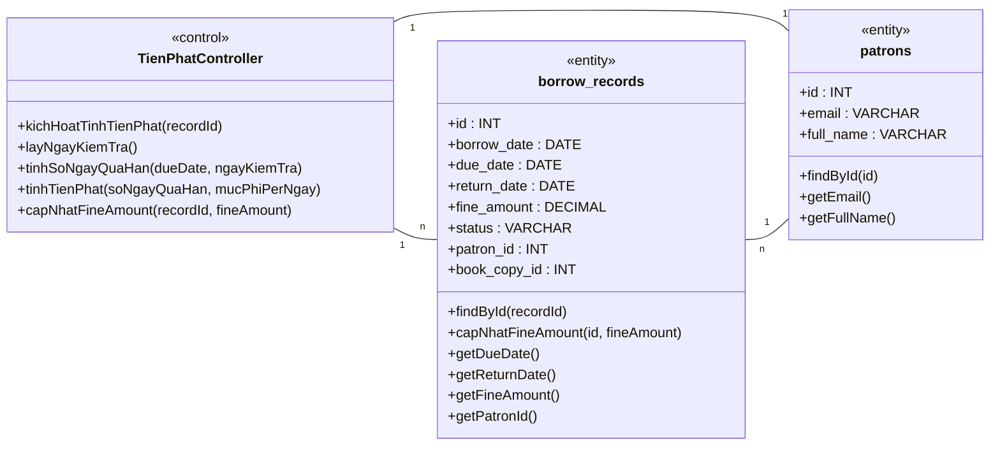
```mermaid
classDiagram
    direction LR
    class TienPhatController {
        <<control>>
        +kichHoatTinhTienPhat(recordId)
        +layNgayKiemTra()
        +tinhSoNgayQuaHan(dueDate, ngayKiemTra)
        +tinhTienPhat(soNgayQuaHan, mucPhiPerNgay)
        +capNhatFineAmount(recordId, fineAmount)
    }
    class borrow_records {
        <<entity>>
        +id : INT
        +borrow_date : DATE
        +due_date : DATE
        +return_date : DATE
        +fine_amount : DECIMAL
        +status : VARCHAR
        +patron_id : INT
        +book_copy_id : INT
        +findById(recordId)
        +capNhatFineAmount(id, fineAmount)
        +getDueDate()
        +getReturnDate()
        +getFineAmount()
        +getPatronId()
    }
    class patrons {
        <<entity>>
        +id : INT
        +email : VARCHAR
        +full_name : VARCHAR
        +findById(id)
        +getEmail()
        +getFullName()
    }
    TienPhatController "1" -- "n" borrow_records
    TienPhatController "1" -- "1" patrons
    borrow_records "n" -- "1" patrons
```

*Hình 2.19. Biểu đồ lớp phân tích – Tự động tính tiền phạt*

---

### 2.3.9. Phân tích use case Tự động thông báo nhắc hạn trả sách

#### 2.3.9.1. Biểu đồ trình tự

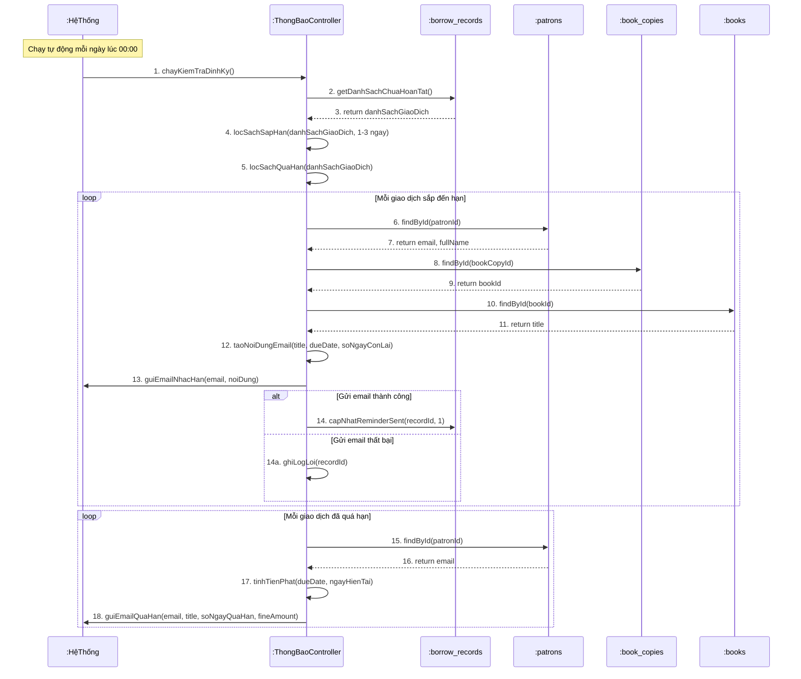
```mermaid
sequenceDiagram
    participant HT as :HệThống
    participant CTRL as :ThongBaoController
    participant BR as :borrow_records
    participant P as :patrons
    participant BC as :book_copies
    participant B as :books

    Note over HT: Chạy tự động mỗi ngày lúc 00:00
    HT->>CTRL: 1. chayKiemTraDinhKy()
    CTRL->>BR: 2. getDanhSachChuaHoanTat()
    BR-->>CTRL: 3. return danhSachGiaoDich
    CTRL->>CTRL: 4. locSachSapHan(danhSachGiaoDich, 1-3 ngay)
    CTRL->>CTRL: 5. locSachQuaHan(danhSachGiaoDich)

    loop Mỗi giao dịch sắp đến hạn
        CTRL->>P: 6. findById(patronId)
        P-->>CTRL: 7. return email, fullName
        CTRL->>BC: 8. findById(bookCopyId)
        BC-->>CTRL: 9. return bookId
        CTRL->>B: 10. findById(bookId)
        B-->>CTRL: 11. return title
        CTRL->>CTRL: 12. taoNoiDungEmail(title, dueDate, soNgayConLai)
        CTRL->>HT: 13. guiEmailNhacHan(email, noiDung)
        alt Gửi email thành công
            CTRL->>BR: 14. capNhatReminderSent(recordId, 1)
        else Gửi email thất bại
            CTRL->>CTRL: 14a. ghiLogLoi(recordId)
        end
    end

    loop Mỗi giao dịch đã quá hạn
        CTRL->>P: 15. findById(patronId)
        P-->>CTRL: 16. return email
        CTRL->>CTRL: 17. tinhTienPhat(dueDate, ngayHienTai)
        CTRL->>HT: 18. guiEmailQuaHan(email, title, soNgayQuaHan, fineAmount)
    end
```

*Hình 2.20. Biểu đồ trình tự – Tự động thông báo nhắc hạn trả sách*

---

#### 2.3.9.2. Biểu đồ lớp phân tích

```mermaid
classDiagram
    direction LR
    class ThongBaoController {
        <<control>>
        +chayKiemTraDinhKy()
        +locSachSapHan(danhSachGiaoDich, soNgay)
        +locSachQuaHan(danhSachGiaoDich)
        +taoNoiDungEmail(title, dueDate, soNgayConLai)
        +guiEmailNhacHan(email, noiDung)
        +guiEmailQuaHan(email, title, soNgayQuaHan, fineAmount)
        +tinhTienPhat(dueDate, ngayHienTai)
        +ghiLogLoi(recordId)
    }
    class borrow_records {
        <<entity>>
        +id : INT
        +due_date : DATE
        +return_date : DATE
        +fine_amount : DECIMAL
        +reminder_sent : TINYINT
        +status : VARCHAR
        +book_copy_id : INT
        +patron_id : INT
        +getDanhSachChuaHoanTat()
        +capNhatReminderSent(id, value)
        +getDueDate()
        +getReminderSent()
        +getPatronId()
        +getBookCopyId()
    }
    class patrons {
        <<entity>>
        +id : INT
        +email : VARCHAR
        +full_name : VARCHAR
        +findById(id)
        +getEmail()
        +getFullName()
    }
    class book_copies {
        <<entity>>
        +id : INT
        +book_id : INT
        +findById(id)
        +getBookId()
    }
    class books {
        <<entity>>
        +id : INT
        +title : VARCHAR
        +findById(id)
        +getTitle()
    }
    ThongBaoController "1" -- "n" borrow_records
    ThongBaoController "1" -- "1" patrons
    ThongBaoController "1" -- "1" book_copies
    ThongBaoController "1" -- "1" books
    borrow_records "n" -- "1" patrons
    borrow_records "1" -- "1" book_copies
    book_copies "n" -- "1" books
```

*Hình 2.21. Biểu đồ lớp phân tích – Tự động thông báo nhắc hạn trả sách*

---

### 2.3.10. Phân tích use case OCR – Dữ liệu số

#### 2.3.10.1. Biểu đồ trình tự

```mermaid
sequenceDiagram
    actor ThuThu as :ThuThu
    participant UI as :OCRUI
    participant CTRL as :OCRController
    participant DB as :books

    ThuThu->>UI: 1. clickQuetTaiLieuOCR()
    UI-->>ThuThu: 2. hienThiGiaoDienTaiLen()
    ThuThu->>UI: 3. taiLenFile(file: PNG/JPG/PDF)
    UI->>CTRL: 4. kiemTraDinhDangFile(file)
    alt Định dạng không hỗ trợ
        CTRL-->>UI: 4a. return loi("Định dạng file không được hỗ trợ")
        UI-->>ThuThu: 4b. hienThiThongBaoLoi()
    end
    CTRL->>CTRL: 5. tienXuLyAnh(file)
    Note right of CTRL: Lọc nhiễu, tăng độ tương phản
    CTRL->>CTRL: 6. thucHienOCR(fileXuLy)
    Note right of CTRL: Nhận dạng ký tự quang học
    CTRL->>CTRL: 7. trichXuatDuLieu(ketQuaOCR)
    Note right of CTRL: Trích xuất: isbn, title, năm XB, nội dung
    alt Ảnh mờ, không nhận dạng được
        CTRL-->>UI: 7a. return loi("Không thể nhận dạng. Vui lòng tải ảnh rõ nét hơn")
        UI-->>ThuThu: 7b. hienThiThongBaoLoi()
    end
    CTRL-->>UI: 8. return duLieuTrichXuat(isbn, title, year, fullText)
    UI-->>ThuThu: 9. hienThiKetQuaVaChoPhepChinhSua()
    ThuThu->>UI: 10. kiemTraVaXacNhanDuLieu()
    UI->>CTRL: 11. luuDuLieuOCR(isbn, title, year, fullText)
    CTRL->>DB: 12. findByIsbn(isbn)
    DB-->>CTRL: 13. return bookId
    CTRL->>DB: 14. capNhatFullText(bookId, fullText)
    DB-->>CTRL: 15. return ketQua
    CTRL-->>UI: 16. return "Trích xuất và lưu dữ liệu thành công"
    UI-->>ThuThu: 17. hienThiThongBaoThanhCong()
```

*Hình 2.22. Biểu đồ trình tự – OCR – Dữ liệu số*

---

#### 2.3.10.2. Biểu đồ lớp phân tích

```mermaid
classDiagram
    direction LR
    class OCRUI {
        <<boundary>>
        +clickQuetTaiLieuOCR()
        +hienThiGiaoDienTaiLen()
        +taiLenFile(file)
        +hienThiKetQuaVaChoPhepChinhSua()
        +kiemTraVaXacNhanDuLieu()
        +hienThiThongBaoLoi()
        +hienThiThongBaoThanhCong()
    }
    class OCRController {
        <<control>>
        +kiemTraDinhDangFile(file)
        +tienXuLyAnh(file)
        +thucHienOCR(fileXuLy)
        +trichXuatDuLieu(ketQuaOCR)
        +luuDuLieuOCR(isbn, title, year, fullText)
        +capNhatFullText(bookId, fullText)
    }
    class books {
        <<entity>>
        +id : INT
        +title : VARCHAR
        +isbn : VARCHAR
        +publication_year : INT
        +full_text : TEXT
        +findByIsbn(isbn)
        +capNhatFullText(id, fullText)
        +setTitle()
        +setIsbn()
        +setPublicationYear()
        +getFullText()
        +getId()
    }
    OCRUI "1" -- "1" OCRController
    OCRController "1" -- "1" books
```

*Hình 2.23. Biểu đồ lớp phân tích – OCR – Dữ liệu số*